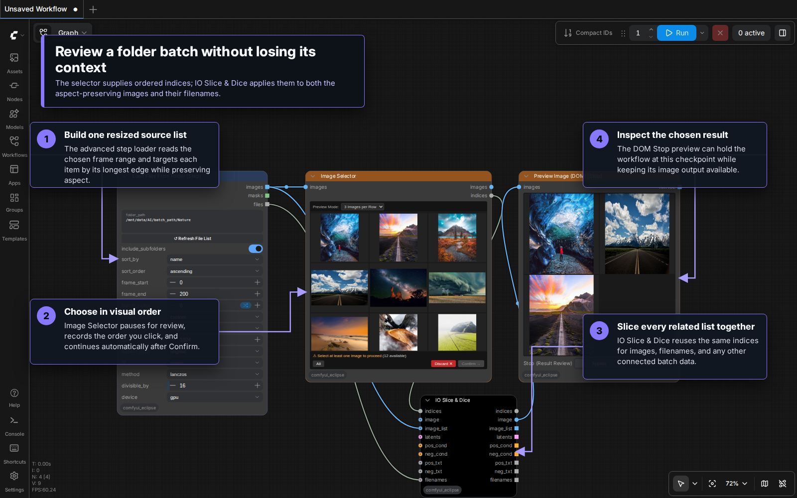
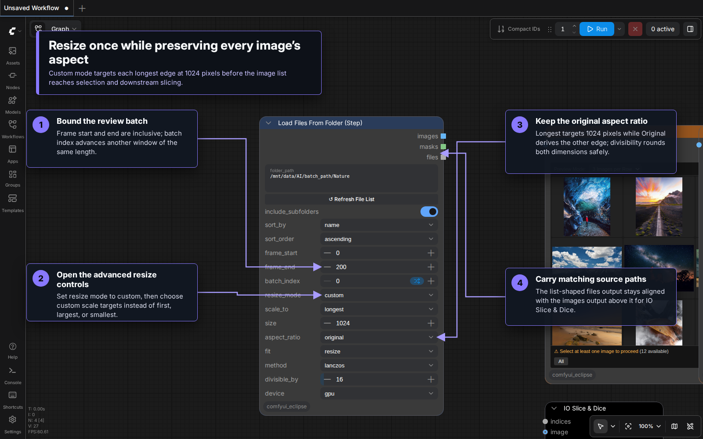
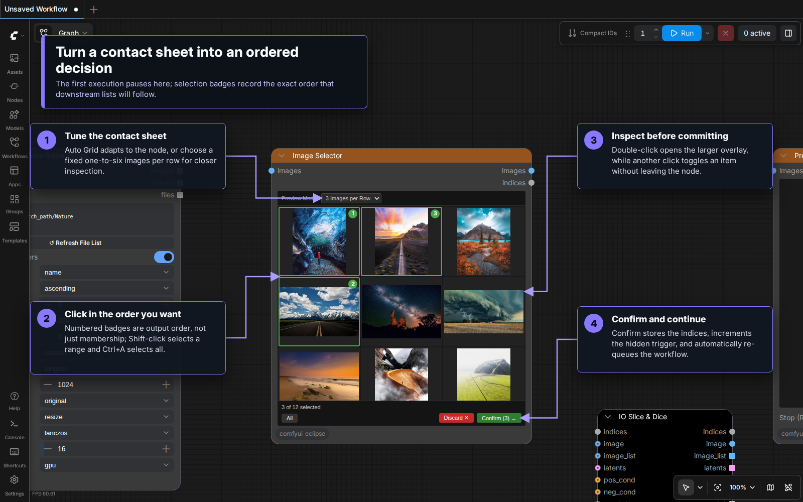
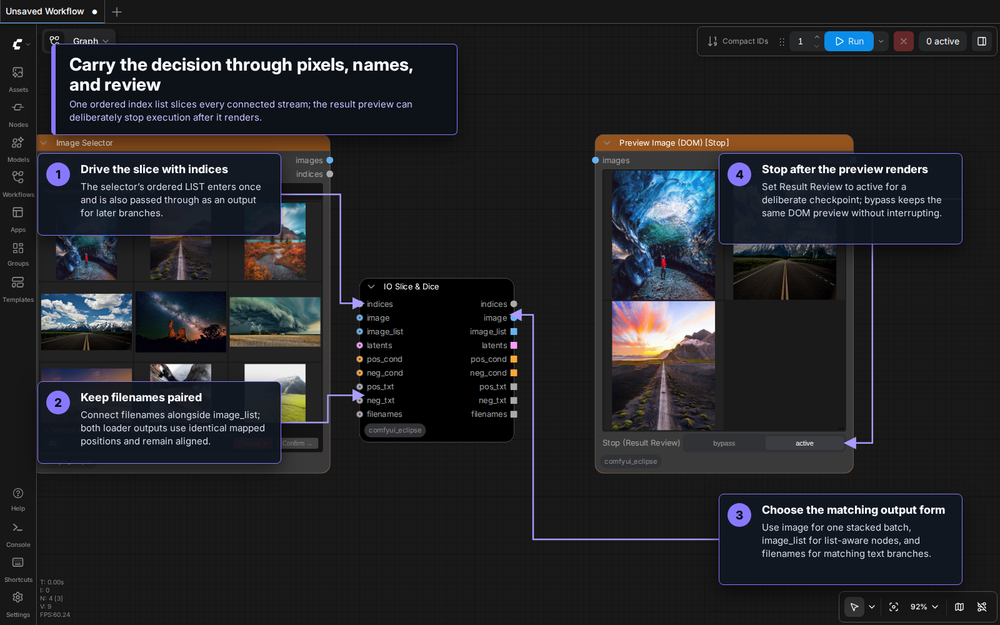

# Batch Selection, Slice & Dice, and Review

This workflow turns a folder into a visually reviewed, ordered subset without losing the relationship between each image and its filename. It combines four Eclipse nodes:

1. **Load Files From Folder (Step)** loads a bounded frame range and applies the saved aspect-preserving resize policy.
2. **Image Selector** pauses on a contact sheet and returns the indices in selection order.
3. **IO Slice & Dice** applies those indices to every connected batch or list.
4. **Preview Image (DOM) [Stop]** displays the result and can pause the workflow for a final review.

The important wiring choice is to connect the loader's `images` and `files` outputs directly to IO Slice & Dice, then use only the selector's `indices` output to drive the slice. Images and filenames therefore remain aligned in the exact order you select them.

## Visual tour



### 1. Resize the source batch



Set `resize_mode` to `custom`, `scale_to` to `longest`, `size` to `1024`, and `aspect_ratio` to `original`. Each image entering the selector and IO Slice & Dice keeps its own aspect ratio while its longest edge targets 1024 pixels. With `divisible_by=16`, both calculated edges are rounded to workflow-friendly multiples of 16.

The loader applies its controls in this order:

- It creates one sorted file list from `folder_path`, optionally including subfolders.
- `frame_start` and `frame_end` select an inclusive window. Negative positions count back from the end; `-1` means the final frame.
- `batch_index` shifts that window by its own length, making repeated batches resumable.
- `resize_mode=custom` applies `scale_to`, target size, aspect ratio, fit method, interpolation, divisibility, and device to every item.

The relevant outputs are list-shaped:

- `images`: the individually resized images; their dimensions can differ because original aspect ratios are retained.
- `files`: their corresponding source paths in the same order.
- `masks`: alpha-derived masks when a later branch needs them.

## 2. Select images visually



The first execution displays the source images and interrupts the workflow at Image Selector. Click images in the order you want them downstream; the numbered badges show that output order.

- Click toggles one image.
- Shift-click selects or clears a range from the last clicked image.
- Ctrl+A selects all; Escape clears the selection.
- Double-click opens the large in-node preview.
- **Confirm** stores the ordered indices, updates the internal execution trigger, and automatically re-queues the workflow.
- **Discard** clears the current decision so the next queue opens a fresh selection.

`Preview Mode` can adapt automatically or hold the grid at one through six images per row. The node keeps the grid inside its chosen dimensions and scrolls when more images are available.

Image Selector also has an `images` output, but this workflow intentionally leaves it unconnected. The `indices` output is enough to apply the same decision to several related streams in IO Slice & Dice.

## 3. Slice images and filenames together



Connect the workflow as follows:

| From | Output | To | Input |
|---|---|---|---|
| Load Files From Folder (Step) | `images` | Image Selector | `images` |
| Image Selector | `indices` | IO Slice & Dice | `indices` |
| Load Files From Folder (Step) | `images` | IO Slice & Dice | `image_list` |
| Load Files From Folder (Step) | `files` | IO Slice & Dice | `filenames` |
| IO Slice & Dice | `image` | Preview Image (DOM) [Stop] | `images` |

IO Slice & Dice accepts optional image batches, image lists, latents, positive and negative conditioning, prompt text, and filenames. Every connected value is mapped through the same ordered indices. Its main image forms are:

- `image`: one stacked image batch, convenient for ordinary IMAGE inputs.
- `image_list`: the selected items as a list for list-aware nodes.
- `filenames`: the matching selected source paths.
- `indices`: the original decision passed through for another branch.

When only `image_list` is connected, the node also constructs the stacked `image` output. List-aware branches retain each loader result as an individual image. The stacked `image` output fits differing shapes to one batch geometry when that representation is needed.

### Example consumer: Save Prompt

[Save Prompt](Save_Prompt.md) is one practical consumer of the preserved image–filename relationship. In a captioning branch, send the selected images through a vision or caption model and connect its ordered text output to Save Prompt's `text` input. Connect IO Slice & Dice's matching `filenames` output directly to `filename_opt`:

```text
IO Slice & Dice image_list → vision/caption model → Save Prompt text
IO Slice & Dice filenames ───────────────────────→ Save Prompt filename_opt
```

As long as the captioning branch preserves list order, Save Prompt receives each generated caption beside the full path of the image that produced it. Its default `filename_prefix=%source_filename` derives the original name from `filename_opt`; with `use_source_folder=true`, the prompt can be saved alongside the corresponding source image.

## 4. Add a review checkpoint

Preview Image (DOM) [Stop] renders all selected images inside the node. `Stop (Result Review)` has two states:

- `bypass`: preview and continue normally.
- `active`: render the preview, then interrupt the current execution at this checkpoint.

Its `IMAGE` output remains list-shaped, so the same review node can sit in the middle of a larger list-aware workflow. Use `active` while curating or checking a batch, then switch to `bypass` when the downstream chain is ready to run unattended.

## Practical notes

- Keep filenames or other metadata connected to IO Slice & Dice whenever their relationship to the images matters.
- Selection order is significant. Choosing source items 1, 4, then 2 produces indices `[0, 3, 1]` and slices every connected list in that order.
- Changing the upstream image content invalidates the stored selection and opens the selector again.
- The saved `method=lanczos` plus `device=gpu` combination falls back to bicubic because this node's GPU path does not support Lanczos. Choose `device=cpu` when actual Lanczos interpolation is required.
- The loader requires a backend-visible folder path. Absolute paths are supported; remote browser paths that the ComfyUI server cannot access are not.
- Use `frame_end=-1` to include everything through the final file.
