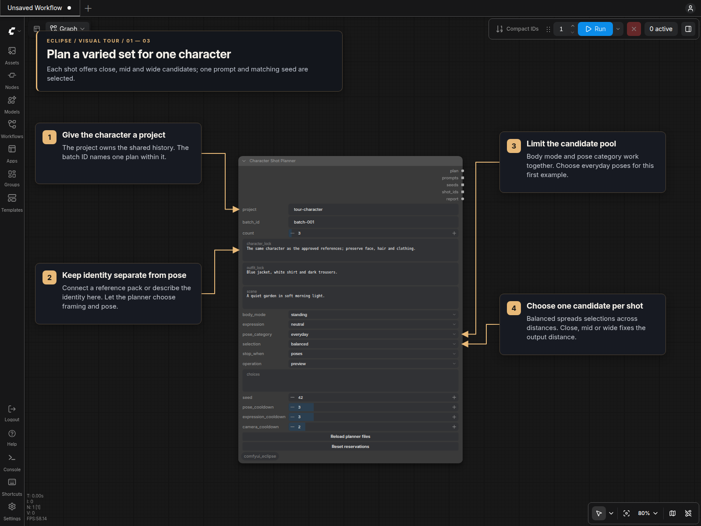
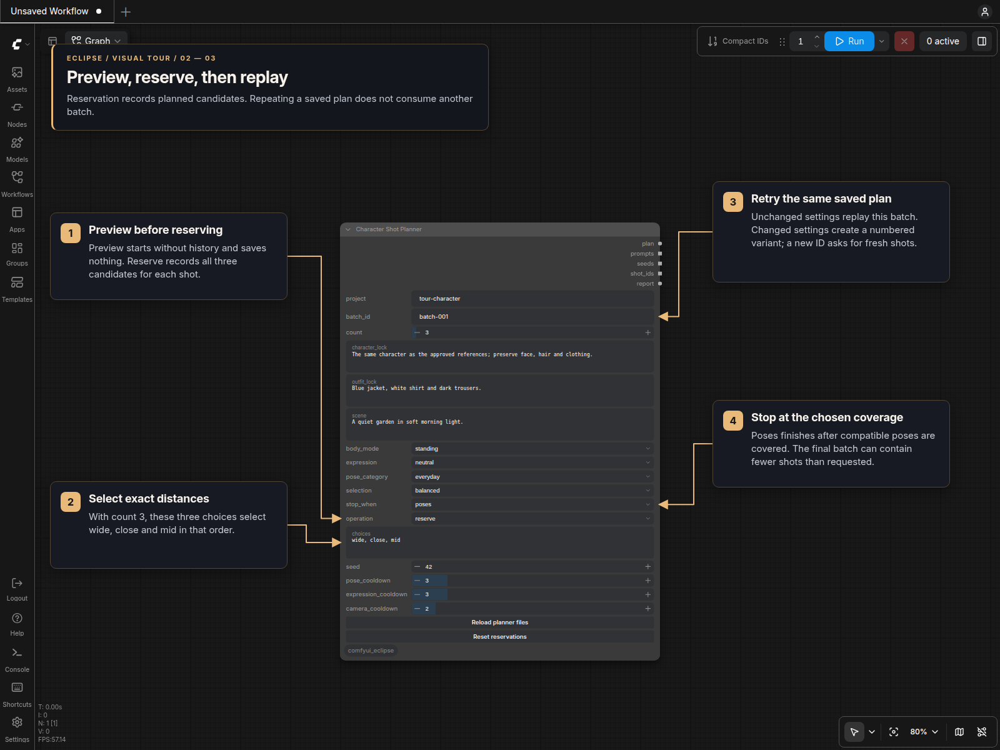
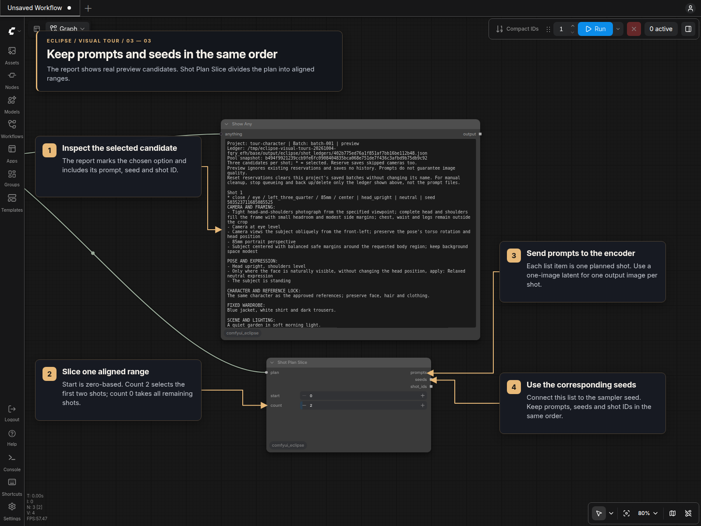

# Character Shot Planner

**Character Shot Planner [Eclipse]** creates compatible prompt candidates for a
recurring character and remembers every reserved camera combination. It runs
locally without a model, account, API key, or network service.

Choose **Planner** (the default) for automatic candidates, or **Manual** to supply
your own shots through the optional `manual_shots` STRING input. Both modes return
the same five outputs: `plan`, `prompts`, `seeds`, `shot_ids`, and `report`.

The node consumes connected lists in **one execution** and creates one plan.
In both modes, `character_lock`, `outfit_lock`, and `scene` accept a single string
or a text list. Nonblank text items are joined with blank lines into one shared
field, then included in every shot. They do not create separate plans or pair
individual outfits with individual shots. Planner also combines text lists in
`choices`, preserving selection order.

Project/batch IDs, mode, numeric controls, and selections require one value.
An empty or multiple-value list on an active control raises a clear error;
values are never silently discarded. Manual ignores the hidden Planner controls,
and Planner ignores `manual_shots` and `manual_start`.

In Planner mode, each shot has three candidates: close, mid, and wide, with different
poses and, in random expression mode, different expressions. One is selected for generation. The node returns the
selected prompts and their matching seeds and shot IDs as ComfyUI lists, plus a
complete plan and a readable candidate report.

New Planner prompts lead with camera/framing and pose, followed by separate
character/reference, wardrobe, scene/lighting, anatomy, surface-text, quality and final-output sections. Multiline
reference instructions remain intact. Previously reserved batches keep their saved
prompt formatting; choose a new batch ID to apply formatting changes when the
settings are otherwise unchanged.

It plans prompts; it does not lock an image's identity, inspect generated anatomy,
detect image duplicates, or record whether an image was accepted. Keep your
reference-image conditioning and review the results.

## Manual shots

Connect multiline text or a **STRING list** to `manual_shots`, then select
**Manual**. You can connect either the `string` or `list` output of **Wildcard
Processor List**; both produce the same shots from its expanded text. The whole
input is consumed once. Each trimmed, nonempty line supplies one shot, including
lines within list items. Blank lines are ignored; order and duplicate entries are
preserved. A shot cannot span multiple lines in this input.

The prompt contains the entry first, then the nonempty shared `character_lock`,
`outfit_lock`, and `scene` fields, separated by blank lines. No automatic camera,
pose, expression, staging, quality, or other generic instructions are added. Clear
the shared fields if each line already contains the complete prompt.

`manual_start` is **1-based** and counts nonempty entries. `count` selects up to
100 entries beginning there, without wrapping. For two batches of 25 from one
list, keep the list connected and use:

| Batch | manual_start | count |
| --- | ---: | ---: |
| First 25 entries | 1 | 25 |
| Next 25 entries | 26 | 25 |

A final batch returns the remaining entries. Missing/blank text, an empty list,
non-text list items, or a start beyond the list is an error. Keep the source text
and its wildcard seed fixed, and keep `project`, `batch_id`, and `seed` unchanged to preserve
per-entry IDs and generation seeds when splitting a list into batches. Manual IDs
use `batch_id/absolute-entry-number/manual`, for example `batch-001/0026/manual`.
Editing earlier lines can change entry positions and therefore their IDs/seeds.

Manual always runs as **preview**, bypassing planner files and reservation history,
even when the saved `operation` is `reserve`. It still produces prompts that can
generate images. Body mode, expression, pose category, selection, stop condition,
operation, choices, cooldowns, and the reload/reset buttons are hidden. Their
values and connections remain saved and return when switching to Planner.
`manual_shots` remains available in both modes; Planner ignores its text or list
without repeating the planner for each entry.

## Visual tour

### Set up the character and candidate pool

Keep identity, wardrobe and scene instructions separate from the camera and pose
choices. Start with a small preview batch while choosing the filters.



### Preview, reserve and replay

Preview uses empty history without reserving shots. Reserve saves candidates;
repeating the same saved settings replays the plan. Changed settings create a
numbered batch variant.



### Keep the generation lists aligned

The captured report comes from an executed three-shot preview. Shot Plan Slice
selects a range while keeping prompts, seeds and shot IDs together.



## Customize the examples

Edit these files inside the Eclipse installation:

| File | Editable content |
| --- | --- |
| `prompts/shot_planner/camera.json` | Framing descriptions, camera heights and families, allowed distances, subject orientations, lenses and compositions. |
| `prompts/shot_planner/poses.json` | Pose descriptions with allowed distances and body modes. |
| `prompts/shot_planner/expressions.json` | Expression IDs and descriptions. |
| `prompts/shot_planner/rules.json` | Hand/arm staging, no-text instructions, quality/style wording and close-shot body descriptions. |

Save your edits, then click **Reload planner files** on the planner. A successful
reload reports the current pose/expression counts and refreshes the expression
dropdown without changing its selected value. Invalid files produce a
file-specific error; fix the file and click again. New batches also read the files
automatically, so no restart is needed after editing. Restart ComfyUI once after
installing the node/extension update.

Existing workflows receive the button automatically. No rewiring or additional
node inputs are needed.

Keep `schema_version` at `1`. JSON uses double quotes and does not support comments
or trailing commas. Each object key is a stable ID used in history. Change its
description to improve wording; give genuinely new options new IDs. Renaming an
old option merely to evade history defeats the no-repeat rule.

For example, a pose entry in `poses.json` is:

```json
"walking": {
  "distances": ["wide"],
  "body_modes": ["standing"],
  "text": "Walking slowly with arms relaxed, both legs and feet clearly visible"
}
```

You can add a seated pose like this alongside the existing entries:

```json
"seated_open_book": {
  "distances": ["mid", "wide"],
  "body_modes": ["seated"],
  "text": "Seated with an open blank book resting on the lap, one hand on the book and the other resting separately on a thigh"
}
```

Only `close`, `mid`, and `wide` distances and `seated`/`standing`/`lying` body modes are
supported. Set compatibility according to what will be visible. For example,
walking needs wide framing; table-height camera options normally suit close/mid
shots. The planner follows your edited matrix and cannot infer anatomy from prose.

Each pose can also have `"category": "everyday"`, `"category": "sports"`, or `"category": "sexy"`.
Omitting it means `everyday`, so existing personal files still load. The node's
`pose_category` filter combines with `body_mode`; `all` includes all three categories.
For boxing and martial arts, use **sports + standing + wide selection** to show
complete stances, footwork and kicks. Close sports shots show athletic preparation
and shoulder/neck warm-ups, not off-frame actions. Seated/lying sports include
compatible stretches and recovery poses. The filter does not change clothing or
the scene; describe those separately if needed.

**Sexy** contains suggestive solo glamour poses for standing, seated and lying
subjects. Close portraits vary shoulder/head posture; mid shots show torso and
arm placement; wide poses include complete leg positions. Wardrobe and facial
expression remain independent. Each posture has enough compatible examples for
the default pose cooldown.

The supplied sexy pool contains 100 pose-only entries: 91 distinct body poses,
six head/shoulder variants and three torso crops derived from those positions.
Wide poses include forward hinges, crouches, cross-legged and folded seating,
sitting on the heels, raised or bent legs, side curls, and supported kneeling.
Low supported kneeling belongs to `lying`; sitting on the heels belongs to
`seated`. Leg-dependent poses are wide-only. Close and mid candidates still need
compatible entries even when wide output is selected.

These descriptions prescribe placement, not appearance: they do not specify
gender, age, hair, skin, physique, body proportions, clothing, exposure or facial
expression. Keep the approved character and wardrobe references connected. Pose
text should never redefine the subject; this separation avoids conflicting
instructions but cannot guarantee visual identity in a generated image.

Camera pools independently combine front, side, rear and left/right rear
three-quarter views with eye, hip, knee, floor and elevated camera positions.
Lying subjects have support-relative heights, a true overhead view and a steep
oblique view. The tilted composition rolls the camera gently without changing the
pose. View directions preserve torso twists and head turns instead of forcing
head/torso alignment. A supported subject is not rolled over to reveal an
occluded surface. Camera/viewpoint wording belongs in `camera.json`, not in poses.

The supplied everyday poses vary benches, stools, sofas, steps, ottomans, floor
cushions and chairs. Seated reclining keeps the torso raised on a sloped support;
lying keeps the body horizontal on a mat, blanket, sofa or daybed. Pose cooldowns
apply to pose IDs, not furniture, so the same support can still recur.

Camera entries have `family`, `text`, and `distances`. The family controls the
camera cooldown. Expression entries are simply `"stable_id": "description"`.
The expression control offers `random`, `off`, and these IDs. Random preserves
distinct candidates and expression cooldowns. A fixed ID applies its wording to
every candidate, ignoring expression cooldown. Off omits planner-generated
expression wording and preserves your character, wardrobe and scene text.
`random` and `off` are reserved control IDs and cannot be expression-file keys.
If a selected ID is removed, it stays selected after reload: new allocations
report a clear error until you restore the ID or select another option. Saved
batches still replay their snapshots, including removed fixed expressions.
The optional `camera.json.body_overrides` object provides posture-specific text:
for example, `body_overrides.lying.cameras.eye` describes a camera beside the
horizontal subject. Its `distances`, `cameras` and `orientations` maps use existing
IDs; omitted entries fall back to the ordinary text. Remove matching overrides
when deleting an ID. Overrides change wording, not camera keys or reservations.
An optional `camera_orientations` map inside each body override selects view text
for a particular camera: `body_overrides.lying.camera_orientations.overhead.front`.
It replaces the ordinary orientation text for that combination. The supplied
overhead entries describe rotation in the image plane, keeping the camera directly
above the subject instead of also asking for an oblique approach.

Pose entries may include `body_descriptions`, mapping a compatible body mode to
additional posture text. For example, a head-tilt pose shared by several body
modes can specify `"lying": "Lying on the back with head and shoulders supported."`
This precedes the pose text only when that body mode is selected. Generic lying
portraits therefore have an explicit supported surface without changing their
standing or seated variants.

Optional `rules.json.expression_prefix` precedes enabled expression text. The
supplied prefix applies expressions only where the face is naturally visible;
quality wording describes visible surfaces without demanding facial detail in a
rear view. Close crops stay head-and-shoulders, and limb staging does not widen
them to include hands outside the requested region. Subject scale and small safe
margins remain part of framing. Existing files may omit these optional fields.
Restart ComfyUI after installing this loader update; later text edits need only
a new preview or, in reserve mode, a new batch ID.

`rules.json.body` needs a posture description for every body mode used by poses.
At least three expressions and three jointly compatible poses are needed for a
candidate set; cooldowns usually require larger pools. Custom pools may exhaust
sooner than the defaults. The loader also bounds file size (256 KiB per file),
pose-list size (512 entries), other object sizes (128 entries) and total camera
combinations (50,000).

To change photographic output to an illustration style, edit `quality` in
`rules.json` **and** the distance descriptions in `camera.json` where they say
photograph/portrait. The character, outfit and scene fields remain editable on
the node. Optional staging, no-text and quality rules can be empty strings.

Reserved batches retain a snapshot of their pools and their resolved prompts.
Editing/removing an option does not change a reserved batch or release its camera
keys. Reuse its batch ID to replay, or choose a **new batch ID** to use the edited
files. This also allows old batches to replay while a current file contains a
typo; new batches and the reload button will report that typo.

Defaults are distributed under `.defaults/prompts/shot_planner/*.json.example`.
The editable directory is initialized when absent. Existing files are preserved,
including malformed files; a missing file in an existing directory is reported
rather than silently replaced. To restore a file deliberately, copy its matching
`.example` file into `prompts/shot_planner/` and remove the `.example` suffix.
Keep personal edits in the editable files, not the distributed defaults.
Older personal pools remain valid but need lying/sports/sexy entries to use those
filters. Merge the new pose entries, the `lying` body rule and camera overrides
from the matching examples, or deliberately restore all matching defaults.

## Basic wiring

```text
Character Shot Planner.prompts → text encoder → reference conditioning → sampler
Character Shot Planner.seeds   → sampler.seed
Character Shot Planner.report → Show Any
```

Keep prompt and seed list order identical. Use a one-image latent per list item;
a larger latent batch creates multiple images for every planned shot.

For multiple generation branches, connect `plan` to **Shot Plan Slice [Eclipse]**.
Each slice returns aligned `prompts`, `seeds`, and `shot_ids`. `start` is zero-based;
`count = 0` means all remaining shots. Invalid ranges raise an error rather than
wrapping or repeating the last item. For Manual plans and final Planner batches
shortened by coverage completion, slices truncate safely and branches past the
end are silently blocked. A slice's `start=0` always means the first shot in the
returned plan, even if that plan used `manual_start=26`.

For example, a 40-shot plan can feed two slices:

| Branch | start | count |
| --- | ---: | ---: |
| Variation 1 | 0 | 20 |
| Variation 2 | 20 | 20 |

## Controls

| Control | Meaning |
| --- | --- |
| `project` | Name of the character/project whose reservation history is shared. Connect a character-name string if useful. |
| `batch_id` | Base ID such as `batch-001`. Same settings replay; changed settings automatically resolve to `batch-001-2`, `batch-001-3`, etc. Change the base for fresh shots with identical settings. |
| `mode` | `Planner` (default) or `Manual`. Appears below `batch_id`. |
| `manual_start` | First nonempty manual entry, 1-based; default 1. Visible only in Manual, directly above `count`. |
| `count` | Up to 1–100 selected shots per batch; coverage completion or the end of a manual list can return fewer. |
| `character_lock` | Shared identity and reference instructions. Required in Planner, optional in Manual. Describe identity without forcing front-facing poses or eye contact. |
| `outfit_lock` | Optional fixed wardrobe. Empty leaves clothing to the generator and references; it does not randomize clothing. |
| `scene` | Shared scene and lighting instructions. |
| `body_mode` | `any`, `seated`, `standing`, or `lying`. Any includes all postures; seated includes supported reclining. Standing permits walking and sports stances in wide shots. |
| `expression` | `random` (default), `off`, or an ID from expressions.json. Fixed/off ignore expression cooldown. |
| `pose_category` | `all`, `everyday`, `sports`, or `sexy`. Combines with body mode and sits immediately above selection. |
| `selection` | `balanced` distributes selections across close/mid/wide using project history. Alternatively select the close, mid, or wide candidate for every shot. |
| `choices` | Optional exact sequence of `close`, `mid`, or `wide`, separated by commas, spaces, or newlines. Supply one value per shot. Overrides `selection`. |
| `seed` | Fixed planner seed, also used to derive each candidate's generation seed. Can be connected to an existing Seed node. |
| `pose_cooldown` | Number of previous selected shots whose poses cannot be offered again. Default 3. |
| `expression_cooldown` | In Planner with random expression, previous selected shots whose expressions cannot be offered again. Default 3. |
| `camera_cooldown` | Number of previous selected shots whose eye/high/low/table camera families cannot be offered again. Default 2. |
| `stop_when` | `poses` (new-node default), `expressions`, `poses_and_expressions`, `cameras`, or `never`. See below. |
| `operation` | `preview` ignores saved history and computes from current files without reserving; `reserve` atomically saves the selected and skipped candidates. |
| `manual_shots` | Optional forced-input STRING socket accepting multiline text or a STRING list in one execution. Required in Manual; ignored in Planner. |

Project/batch replay, pool controls and cooldowns below apply to **Planner**.
In Manual, project and batch ID label the plan and contribute to stable seeds;
they never create or replay a reservation.

## Workflow layout migration

Layout **4** inserts `mode=Planner` and `manual_start=1` below `batch_id`.
Recognized older workflows migrate automatically on load, paste, clone and inside
subgraphs. Named values take precedence over positional values. Existing node IDs,
links, input/output slot positions and saved planner settings are preserved.
Earlier layouts without expression or stop controls keep `expression=random` and
`stop_when=cameras`. Already migrated Manual settings remain unchanged.

Automatic migration changes the loaded graph; save it to keep the updated layout.
To inspect saved JSON files without opening ComfyUI, run the dedicated tool from
the Eclipse directory:

```bash
python tools/migrate_shot_planner_workflows.py /path/to/workflow.json
python tools/migrate_shot_planner_workflows.py /path/to/workflows
python tools/migrate_shot_planner_workflows.py /path/to/workflows --write
```

The default is a **dry run**. Directories are scanned recursively. `--write`
creates a backup beside each changed file (`.json.bak`, then `.json.bak.1`, etc.)
without overwriting earlier backups. Repeat runs leave migrated files byte-for-byte
unchanged. Ambiguous or unknown layouts are reported and their nodes are left
unchanged; other recognized nodes in the file can still migrate. Exit status is
0 for success, 2 when review is needed, and 1 on an error. API prompts have named
inputs and need no widget-layout migration. This tool changes only Shot Planner
layouts; it does not rename other nodes. No workflow directory is rewritten
automatically by this update.

## Preview, select, reserve, replay

**Stop when** controls the finite list to finish:

- **poses**: stop after every compatible pose ID has appeared in a selected output.
- **expressions**: stop after every expression has appeared in a selected output.
  A fixed expression or off has one variant, so this mode finishes after one
  matching selected shot.
- **poses_and_expressions**: finish both lists. The shorter list repeats while
  the longer one finishes; this does not require every pose/expression pairing.
- **cameras**: retain the legacy unique-camera restriction.
- **never**: keep planning new batches, cycling depleted camera pools.

In reserve mode, pose/expression coverage uses selected reservations in project history, filtered
by current body mode, pose category and possible output distances. Skipped
candidates do not consume that coverage. Balanced selection prefers distances
with uncovered compatible poses. Explicit selection/choices keep their requested
distances; unreachable poses do not prevent completion. Adding new IDs extends
coverage. As elsewhere in this node, reservation is not proof of image generation.

In every mode except cameras, each distance uses unused camera combinations
before cycling its least-used combinations. A short close/wide camera list can
repeat while the longer mid list continues. Camera cooldown relaxes only when
necessary, with a warning; pose and random-expression cooldowns remain in force.

In reserve mode, on coverage completion the planner returns the remaining shots, even if fewer
than `count`, saves that final batch in reserve mode, and shows a yellow ComfyUI
popup. Automatic queueing stops without cancelling generation of those final
shots. Shot Plan Slice truncates to available shots; branches beyond the end are
silently blocked. A new request after completion generates nothing and shows a
warning. The saved final batch still replays exactly when requested again.
Camera/pose/expression compatibility or cooldown exhaustion also stops cleanly
with a yellow warning and saves none of the incomplete batch. Invalid files,
removed expression IDs and malformed ledgers still report actionable errors.

Existing workflows migrate automatically, including old positional values,
connected inputs and subgraphs. They default to expression=random and
stop_when=cameras to preserve their old settings and saved-batch replay. Choose
poses to adopt the new default behavior; this creates a new batch variant.

1. Connect `report` to Show Any and set `operation` to `preview`.
2. Execute the planner/report branch only. Review the three candidates per shot.
3. Adjust the locks, settings, or `choices`. For three shots, an example is
   `wide, close, mid`. Re-preview after changes: choices affect cooldowns and may
   change the candidates in later sets.
4. Set `operation` to `reserve` before generating images. With unchanged settings
   and empty project history, the preview and reserved candidates match.
5. Requeue with the same settings and batch ID to reproduce the reserved plan.
6. For fresh shots, change `batch_id`, for example to `batch-002`.

Preview starts with empty history, ignores all saved batches/reservations, and uses
the current editable files. It never reads or updates the ledger. Coverage limits
still apply within the preview: for example, 19 matching poses can produce a final
19-of-50 plan. This shows an informational toast and leaves automatic queueing
enabled. Choose `stop_when=never` to cycle beyond coverage. Preview outputs can
generate images when connected to generation branches, but do not reserve them.
Reserve uses project history, so its candidates may differ when history exists.

After reservation, changing the seed, count, locks, cooldowns, body mode, expression,
pose category, stop mode, selection or choices automatically selects a numbered
variant of the requested batch ID.
For example, changes under `batch-001` use `batch-001-2`, then `batch-001-3`.
Existing reservations remain intact. Repeating the same changed settings finds
and replays their existing variant; restoring the original settings replays the
original batch. Concurrent retries share one reservation.

The input widget stays at the base ID. The report, plan's `batch_id`, and all shot
IDs show the actual resolved ID; `requested_batch_id` records the input value.
Preview always uses the requested base ID without consulting saved variants. Very long IDs use a shortened
prefix with a hash before the number to remain within the 80-character limit.
Changing a connected global seed also changes the planner settings, so it reserves
a new variant. Each new variant consumes camera history just like a manual batch.
Pool-file edits alone still require a new base ID because existing batches replay
their saved pools. Use a new base ID for fresh shots with otherwise identical settings.

Reservations describe planned shots. A failed/cancelled generation does not
release them. Reuse the same plan in reserve mode to retry, or reset deliberately
when you want a fresh start.

## Resetting reservations

Stop queueing, then click **Reset reservations** on the planner. Enter the project
name in the confirmation dialog. If `project` is connected, use the actual connected
name (for example, your character name), not the inactive widget value. Reset clears
all saved batches and their coverage for that project while keeping its name. You
can reuse the same batch IDs. Other projects, generated images and editable prompt
files stay intact. The cleared plans can no longer replay; back up their ledger first
if you need them later. Reset does not cancel an already running generation.

Changing the batch ID or clicking **Reload planner files** does not reset history.
Reservations persist across restarts until reset or removal; the project name itself
is not permanently unavailable. For manual cleanup, stop queueing and back up or
delete **only the project ledger path shown in the report** under
`output/eclipse/shot_ledgers/`. Do not delete `prompts/shot_planner/`: those files
contain the editable pose, expression and camera lists, not reservations. A malformed
ledger is preserved by the reset button and can be backed up/removed manually.

## History and compatibility

Ledgers live under the configured ComfyUI output directory:

```text
output/eclipse/shot_ledgers/<project-name-hash>.json
```

The report shows the exact ledger path. Files retain the project label, batch
settings, candidate prompts, attributes, seeds, and selected/skipped status.
They use locked atomic writes. A malformed ledger fails without being replaced.
Back up this folder along with workflows to preserve history. Reusing a project
label shares its history; use a new label for a different character or fresh
project. Merely saving another workflow filename does not create new history.

The permanent camera key is:

```text
distance + camera height + subject orientation + lens family + composition
```

All three candidates reserve their keys, including the two skipped candidates.
In cameras stop mode, a different pose or expression cannot make a used key
available again. Other stop modes allow camera cycling without deleting history.
Cooldowns are separate temporary exclusions measured in selected shots, including
earlier batches. These rules apply to planner output; unrelated reference shots
elsewhere in a workflow are not imported into its ledger.

The default pools provide 225 close, 270 mid, and 225 wide camera keys. Because
every set needs one of each, in cameras stop mode 225 sets is a combinatorial upper bound, **not a
promised usable capacity**. Cooldowns and previous reservations can make a batch
impossible sooner. In that case the new batch stops with a yellow warning and
without partial reservation. Choose a pose/expression stop mode to let camera
pools cycle, reduce cooldowns, or start a separately named project.

For repeated large batches in cameras stop mode, consider `camera_cooldown=1`. Wide shots have only eye/high/low families; excluding the
previous two selected families can force the remaining family even when its
unique combinations are nearly depleted. Lowering this cooldown retains the
permanent no-repeat camera rule. A new batch ID shares the same project history
and does not replenish its pools. Tune pose and expression cooldowns separately.

Compatibility rules include table-height cameras only for close/mid shots,
walking only in wide shots with feet visible, body-mode filtering, and actions
appropriate to the visible crop. The planner favors less-used subject orientations
and placements. Rear views remain suitable for separate controlled reference
shots; the variation pool uses visible facial expressions.

Every Planner prompt includes simple hand/arm staging. The default surface rules preserve
lettering and graphics on approved clothing and accessories, including their
location, perspective and natural occlusion. Other signs, menus, packaging, book
covers, screens and labels remain blank unless specified otherwise; added captions,
invented lettering and watermarks are excluded. These are generation instructions,
not guaranteed text accuracy or defect removal. Lens and composition differences
also need to be verified in the generated images.
