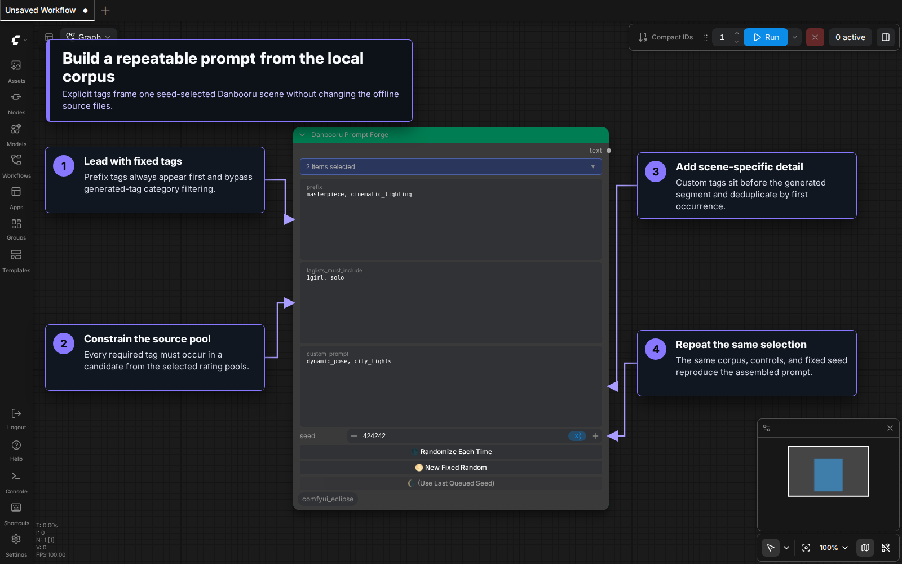
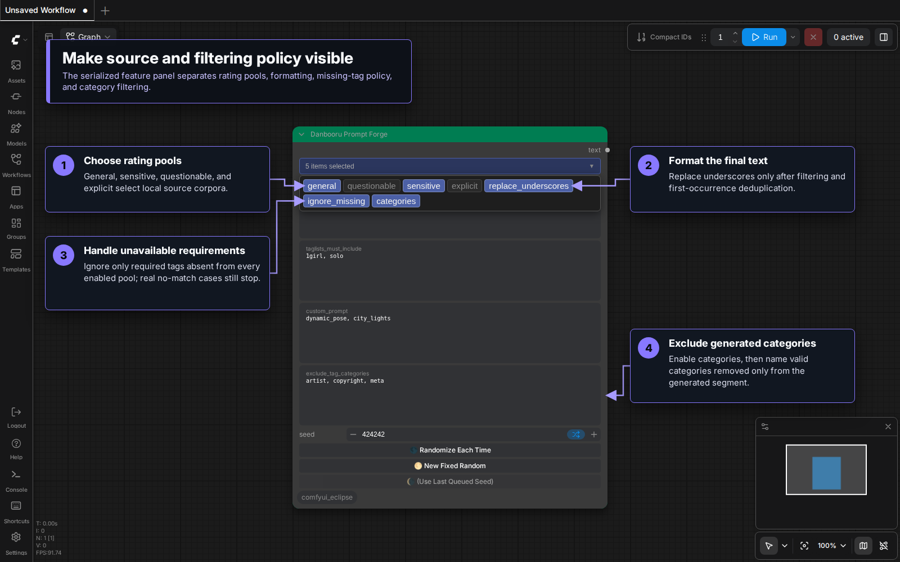
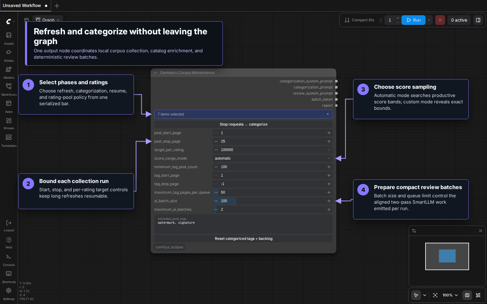

# Danbooru Prompt Forge

Danbooru Prompt Forge selects one taglist from a locally stored offline corpus, then
turns it into a filtered prompt. It is useful for producing seed-repeatable scene
and composition ideas for models that understand Danbooru-style tags.

The node is in `🌒 Eclipse/ Danbooru`. It is an output node, so it can be queued
directly even when none of its outputs are connected.

## Visual tour

### Assemble a repeatable prompt

Use `prefix` and `custom_prompt` for explicit tags, constrain the candidate pool
with `taglists_must_include`, and fix `seed` when the same local corpus selection
should be reproduced later.



### Make filtering policy visible

Open the feature bar to choose rating pools, final underscore formatting,
missing-required-tag behavior, and category filtering. Enabling `categories`
reveals the exclusion field without changing the node dimensions.



### Maintain the offline corpus

`Danbooru Corpus Maintenance [Eclipse]` combines refresh phases and rating pools
with bounded post collection, score sampling, catalog enrichment, and compact
two-pass review batching. Its files and progress remain local; the separately
documented manual export only prepares local work files for an external workflow.



## Selection and filtering

1. The top `features` chip bar chooses which content-rating pools participate:
   `general`, `questionable`, `sensitive`, and `explicit`. It also contains
   `replace_underscores` for output formatting and `ignore_missing` for forgiving
   required-tag matching. The last chip, `categories`, enables category filtering
   and shows the category-exclusion widget. New nodes select `general` and
   `replace_underscores`; the other chips start off, so Prompt Forge initially
   runs directly from the rating corpus without requiring categorization.
   Changing chips or category-widget visibility preserves the node's current
   dimensions, including manually resized and saved sizes.
2. `prefix` adds explicit tags at the beginning of the assembled prompt. It does
   not constrain taglist selection, and editing it preserves the node's current
   dimensions.
3. `taglists_must_include` keeps only candidates containing every listed tag. By
   default, an unavailable required tag produces a no-matches error. With
   `ignore_missing` selected, required tags absent from every enabled pool are
   ignored, the remaining found tags still constrain selection, and the console
   reports which tags were ignored.
4. `seed` deterministically shuffles the remaining candidates and selects one.
   The same corpus, settings, and seed produce the same result.
5. Every selected rating line begins with `post_id, score`; Prompt Forge always
   removes those two metadata fields. With `categories` enabled, tags absent from
   `categorized_tags.txt` are removed from the generated segment, then
   `exclude_tag_categories` removes generated tags assigned to excluded
   categories. With `categories` off, generated tags pass through in their rating
   file order and the category files are not required.
6. `custom_prompt` adds explicit tags after the required tags and before the
   generated segment. The four segments are deduplicated together while keeping
   each tag's first occurrence.

`prefix`, required tags, and `custom_prompt` accept comma- or newline-separated
values. Spaces inside a tag are normalized to underscores, so `white shirt` and
`white_shirt` are equivalent. Explicit prefix, required, and custom tags bypass
category exclusion. When `categories` is enabled, category filtering applies only
to the generated corpus segment; category names are validated, and an
invalid-category error lists the accepted names. When it is disabled, the saved
exclusion value is ignored. For final tag or phrase removal, connect the output to
the dedicated `Filter Prompt [Eclipse]` node. The `replace_underscores` chip
changes underscores to spaces across the complete assembled prompt after
filtering and deduplication.

`ignore_missing` does not replace rating-pool selection and does not relax a set
of found tags that cannot coexist in one candidate. Those cases still produce the
no-matches error. A missing required tag ignored for candidate selection remains
at the start of the final prompt because it was explicitly supplied.

Content-rating controls select source pools; they are not a classifier or a
guarantee about every individual tag. Downloaded or self-created questionable,
sensitive, and explicit pools may produce sexual or otherwise mature content.

## Seed controls

The `seed` widget and its three buttons are grouped below all other widgets at
the bottom of the node. The buttons use Eclipse's shared seed behavior:

- `🌑 Randomize Each Time` keeps the visible seed in random mode and resolves a
  new concrete seed whenever the workflow is queued.
- `🌕 New Fixed Random` generates a concrete seed immediately, so later queues
  reuse it until you change it.
- `🌘 (Use Last Queued Seed)` becomes available after a randomized queue and
  restores the concrete seed used for that queue.

The buttons are hidden while `seed` is converted to a connected input. They are
interface controls only and are not saved as extra workflow widget values.

## Outputs

- `text`: prefix tags, required tags, custom tags, and generated tags in that
  order, globally deduplicated by first occurrence. With `categories` enabled,
  generated tags use the local category-index order; otherwise they retain the
  selected rating line's order.

## Maintaining the corpus with SmartLLM

Two Eclipse nodes replace the old command-line, clipboard, split/combine, and
manual file-replacement scripts:

- `Danbooru Corpus Maintenance [Eclipse]` scans unseen posts into the rating
  corpora, optionally refreshes only the catalog for imported corpora, and
  prepares strict SmartLLM prompts or a manual categorization export.
- `Danbooru Category Apply [Eclipse]` validates the reviewed result and atomically
  appends the valid assignments in each category batch.

### Manual remote-LLM export

Select `manual_categorization` instead of `prepare_ai` to create a complete,
provider-neutral work package for a remote chat service, coding agent, or another
node. The two actions are mutually exclusive, but both may be off. Manual mode
uses `ai_batch_size` (100 by default, up to 500), exports the entire pending
backlog, and ignores and hides `maximum_ai_batches`.

1. Select `manual_categorization` and queue Corpus Maintenance.
2. Open the `prompts/tag_lists/manual_categorization/export-<snapshot-hash>/`
   path shown in the report.
3. Give a remote model `prompts/first_pass.md`, `category_rules.json`, the
   optional `categorized_tags_reference.txt`, and one numbered `inputs/*.json`.
4. Save its strict JSON response under the matching `drafts/NNNNNN.json` path.
5. Start a fresh review context with `prompts/review.md` and that draft, then save
   the final strict JSON under `reviewed/NNNNNN.json`.
6. Repeat manually, or let a filesystem-capable agent process numbered batches
   while skipping result files that already exist.

> [!IMPORTANT]
> Eclipse only prepares this package. It does not upload it, read or validate the
> results, merge them, apply them, or modify `categorized_tags.txt`. Consuming or
> merging reviewed results remains the user's or external tooling's responsibility.

The export contains a manifest with snapshot hashes, numbered input and expected
result filenames, the live category rules and prompt contracts, and a reference
copy of the current categorized index. It contains no private Eclipse batch
tokens. Its ID is derived from the rules, category list, categorized index,
ordered backlog, and batch size. Repeating unchanged work validates and reuses
the same package without overwriting regular files in `drafts/` or `reviewed/`;
changed source content creates a new snapshot. Eclipse rejects symlinked packages
and changed generated manifests, prompts, rules, references, or inputs.

SmartLLM remains a separate extension. Install ComfyUI SmartLLM and use two
`Smart LM Loader [Eclipse]` instances. Current SmartLLM versions expose the
prompt sockets directly, so no widget conversion is needed. Connect the workflow
in this order:

1. Maintenance `categorization_system_prompt` → loader 1 `system_prompt`.
2. Maintenance `categorization_prompt` → loader 1 `user_prompt`.
3. Loader 1 `text` → loader 2 `user_prompt`.
4. Maintenance `review_system_prompt` → loader 2 `system_prompt`.
5. Loader 2 `text` → Category Apply `reviewed_text`.
6. Maintenance `batch_token` → Category Apply `batch_token`.

The maintenance outputs are aligned lists. ComfyUI maps the first loader and the
second loader across the same capped batches, while Category Apply receives the
mapped results together for stale-state and atomic-commit checks. Use a text-only
LLM, keep SmartLLM's `Multi-Task` option off, use its direct-chat path, disable
sampling with `do_sample = false`, and keep `num_beams = 1` for deterministic
greedy decoding. Temperature is ignored while sampling is disabled. Give both
loaders enough context for the category rules and up to 100 tags. These settings
keep each input batch aligned with exactly one strict JSON response. Both system
prompts require minified single-line JSON without indentation, line breaks, or
optional spaces so the first-pass draft and second-pass review spend their output
budget on assignments instead of formatting.

Prefer a Qwen 3.x instruct model in the 8B/9B class or larger for both passes.
Qwen 3.5 9B is the exact-preserving successful baseline. Qwen 3.8 27B categorized
a broad test set well but has also been observed repeatedly replacing individual
underscores with spaces. Category Apply reconstructs that mutation only when
replacing every literal space produces an exact private-manifest tag; case,
punctuation, and all other mutations remain rejected. Other model families and
sizes remain unqualified until a small-batch trial produces complete output
accepted by Category Apply.

> [!WARNING]
> The tested Ministral 3 first-pass plus Llama 3 reviewer pairing is not
> recommended for this workflow. Ministral 3 produced numerous implausible
> category choices, while Llama 3 copied schema placeholders, rewrote exact tag
> strings, invented category names, emitted invalid JSON escapes, and truncated
> reviews. Model variants can differ, but an unverified local model should first
> be tested with `ai_batch_size` at 50 or lower and its Category Apply report
> inspected before processing the full backlog.
>
> The tested Gemma 3 4B abliterated model is also not recommended. It split one
> batch into many JSON roots, omitted assignments, repeated and corrupted exact
> tags, and invented invalid category strings. The same failures remained with
> `ai_batch_size` reduced to 20, so they were not caused only by output length.
>
> The tested Qwen 2.5 VL Instruct 3B model is not recommended. In a 20-tag trial,
> it split exact emoticon tags into punctuation fragments, duplicated those
> fragments, omitted an assignment, and collapsed every category to
> `abstract_symbols`. This result does not qualify or disqualify larger Qwen 2.5
> variants, which still require their own small-batch test.

SmartLLM maps list-valued user prompts while sharing one connected system prompt
across those runs. Eclipse therefore gives every batch the same rule-based system
prompts. The first pass copies its exact ordered input into an `original_tags`
field beside its draft assignments; the shared second-pass prompt treats that
field as immutable and returns only the reviewed assignments. Category Apply then
checks the final order and values against the private Eclipse batch manifest.
Assignments applied from the final output must form a unique ordered subset of
the manifest. Omitted tags and assignments using invalid category names remain
pending for a later preparation run. Assignments whose tag is not in the manifest
are discarded without being applied, allowing exact earlier assignments to be
salvaged when a truncated draft makes the reviewer guess an incomplete tag.
If a model changes only underscore separators into literal spaces, Category Apply
restores the original value only when the reverse substitution matches one exact
private-manifest tag. If an apply run makes no progress at all while tags remain
pending, the node raises an execution error so ComfyUI Auto Queue stops instead
of repeating the same rejected batch; correct the model or output and queue again.
If the JSON envelope is malformed, Category Apply can also recover exact
assignment objects that independently validate against the private manifest. It
commits every complete sequential assignment before a clean output-limit cutoff
inside the next object, leaving that incomplete object and the remaining tags for
the next batch instead of repeating the entire batch. It never invents or closes
the truncated string. Category Apply also
handles the reviewer's narrowly observed missing opening quote on the literal
`category` key, applies the remaining valid ordered subset, and leaves every
unrecoverable tag pending. If known tags are duplicated or reordered, Category
Apply keeps the largest unique manifest-ordered subset and leaves the displaced
tags pending instead of rejecting every correct assignment in that batch.

### Refresh controls

Corpus Maintenance's chip bar selects `refresh_ratings`, optional catalog-only
`refresh_catalog`, mutually exclusive `prepare_ai` or `manual_categorization`,
`resume`, and the general, sensitive, questionable, and explicit rating files. A
rating refresh discovers work from unseen `/posts.json` records and enriches the
resulting pools from `/tags.json`. When `prepare_ai` is selected, it then prepares
SmartLLM batches; manual mode instead writes the complete numbered export and
blocks all four SmartLLM-chain outputs.
`post_start_page` and `post_stop_page` define an inclusive logical request range
for every selected rating. The default stop value of `-1` scans until the
configured score range is exhausted, the global 3,000-request
safety cap yields cleanly, or `target_per_rating` is reached. The rating target
defaults to and is capped at 100,000 unique posts per selected rating. Lower
targets are supported; existing imported files above the selected target are left
intact and receive no additional posts.

For a rating-only workflow, turn off both `prepare_ai` and
`manual_categorization`, and leave Prompt Forge's `categories` chip off. Corpus
Maintenance continues filling the selected rating files across later queues even
when uncategorized general tags are pending, but it does not send batches to
SmartLLM or Category Apply. Prompt Forge reads those rating files directly and
does not require `categorized_tags.txt`. Enabling
`prepare_ai` or `manual_categorization` restores the backlog gate so categorization
catches up before more network collection. Existing pending work is prepared or
exported immediately without another network request. A fresh rating or catalog
run finishes first and then prepares or exports the backlog it produced.

While `refresh_ratings` is selected, `excluded_post_tags` accepts exact Danbooru
tags separated by commas or new lines. A comma at the end of a line is treated
as one separator rather than creating an extra entry. Surrounding whitespace and
blank or duplicate entries are ignored. A newly returned post
containing any listed whole tag is denied for every selected rating, so it does
not enter a rating file, the general-tag backlog, authoritative categories, or
later catalog enrichment. Similar tags remain distinct: excluding `rape` does not
exclude `grape` or `attempted_rape`. Denied posts still advance the saved
page/cursor and do not count toward `target_per_rating`. The filter affects only
subsequent API responses; changing or hiding it preserves its serialized value
and does not rewind or change checkpoint identity. Existing corpus records are
not purged.

The default AI controls prepare one batch containing at most 100 general tags.
Increasing `maximum_ai_batches` maps more batches through both SmartLLM passes in
the same queue. Any spill remains in the ordered private backlog for the next
queue.

### Rating post-score range

The general, sensitive, questionable, and explicit chips select Danbooru content
ratings. The separate `score_range_mode` controls the Danbooru popularity score
used while filling those selected post pools:

- `automatic` samples the 1024 through 5,000 score band first, then
  halves downward through 512–1024, 256–512, and so on until 0–1. This keeps the
  high-score bias without excluding currently observed high-score posts. The
  5,000 ceiling also bounds custom score inputs and checkpoint identities.
- `custom` reveals `custom_score_min` and `custom_score_max` and keeps that
  inclusive range as one band for every selected rating. Negative scores are
  accepted; both values must not exceed 5,000 and the minimum must not exceed
  the maximum.

Pagination adapts to the density of the current band. Sparse bands whose minimum
score is at least 64 use Danbooru's score index and saved numeric pages. This
avoids forcing the server to scan a huge post-ID span to find a handful of very
high-scoring general or sensitive posts. Lower, denser bands choose a persisted
randomized post-ID split and use descending-ID order with `b<ID>` cursors. They
walk from that random region toward older posts, wrap once to the newest matching
post, and finish when they reach the saved split from above. Duplicate-only pages
continue through the cursor instead of falsely marking a band exhausted. A
completely fresh dense band uses its first successful page to establish the
initial ID range. Every unseen ID is appended until the per-rating target and is
never written twice. This keeps the high bands efficient and the lower bands
broadly sampled without the expensive server-side `order:random` query. See Danbooru's
[post API fields](https://danbooru.donmai.us/wiki_pages/api:posts)
and [common pagination parameters](https://danbooru.donmai.us/wiki_pages/help:common_url_parameters).

Before each post request, Maintenance selects the enabled rating file with the
fewest retained posts, matching the Raffle scraper's balancing behavior. Equal
counts use the visible general, sensitive, questionable, explicit order only as a
stable tie-breaker. A post-query HTTP 500, 502, 503, or 504 is retried normally;
if every retry fails, Eclipse preserves that rating's current logical page and
score band, temporarily parks only that rating, and retries it after four
successful post responses from other ratings. If that same saved page fails
again, or the other ratings finish before supplying the cooldown, Eclipse leaves
it resumable for the next queue. Other selected ratings continue normally.
Authentication, authorization, and malformed-response failures remain fatal
instead of being mistaken for exhaustion.

Each API response is committed before the next request. Unseen posts are published
to Prompt Forge's live `taglists-*.txt` file. Their artist, copyright, character,
and meta strings are assigned directly to Danbooru's authoritative categories.
Only general tags absent from `categorized_tags.txt` enter the ordered,
deduplicated backlog. Category Apply publishes accepted AI assignments to the live
category index and drains those tags from the backlog. The backlog is harmless in
rating-only mode; it is retained in case categorization is enabled later.

After post collection finishes or is stopped, Corpus Maintenance runs its catalog
intersection. `minimum_tag_post_count`,
`tag_start_page`, `tag_stop_page`, and `maximum_tag_pages_per_queue` control that
intermediate phase. Eclipse reserves its catalog-page budget from the global
3,000-request safety window, publishes authoritative catalog categories, and
adds only remaining in-pool general tags to the SmartLLM backlog. Selecting
`refresh_catalog` without `refresh_ratings` reruns this enrichment against the
existing rating files.

For a true fresh start, the entire `prompts/tag_lists/` directory may be removed
before running Corpus Maintenance. Maintenance restores the required
`categories.txt` and `category_rules.json` contracts from their `.defaults`
examples and creates empty rating and categorized-tag files. It does not restore
or populate a rating corpus in this path, so collection and categorization restart
from zero.

Post checkpoints are independent for each rating and score configuration. After
every response, Eclipse records the logical request, score-range index, numeric
score page or randomized region cursor, wrap phase, and completion state. Legacy
post checkpoints migrate to the adaptive schema while preserving their logical
request and score band. With `resume` enabled, each rating uses its own saved band
and pagination state. With resume disabled, request 1 starts over; a later
`post_start_page` may rewind only when its complete checkpoint prefix exists.
Rewinding never duplicates an ID because the live rating file remains
authoritative.

If a backlog already exists when categorization is selected, Corpus Maintenance
makes no post request. SmartLLM mode prepares only the next configured batches;
manual mode exports every pending tag regardless of `maximum_ai_batches`. This
hard gate prevents collection from outrunning categorization. A request,
authentication, or malformed response error leaves all earlier page commits
intact. Reaching the request safety cap is a successful yield: current state is
retained and any newly collected backlog is sent onward.

`Stop requests → categorize` is local to this Corpus Maintenance node. It does
not interrupt the ComfyUI queue or discard an in-flight response. Eclipse commits
that response and its checkpoint, skips further post requests and ratings, and
then runs catalog enrichment before preparing the saved backlog for SmartLLM or
the manual export selected on the node. If no post request is active, the button
reports that state and leaves the queue unchanged.

`Reset categorized tags + backlog` is the final control at the bottom of Corpus
Maintenance. After confirmation, it keeps the existing rating files, post and
catalog checkpoints, and every authoritative artist, character, copyright, and
meta assignment. It removes all model-assigned categories, rebuilds the complete
general-tag backlog from the tags already present across all four rating files,
and invalidates prepared AI batch manifests so results from the old category
index cannot be applied afterward. The categorized index and previous backlog
are backed up before replacement. This reset does not repeat rating collection.

Network actions always invalidate ComfyUI's execution cache. Backlog-only runs use
the conditional fingerprint: they re-execute while pending work exists and become
stable when it is drained. When a scan accepts no new posts, or accepted posts add
no uncategorized general tags, Maintenance keeps a clear report but sends silent
blockers through its four AI-chain outputs. Neither SmartLLM pass nor Category
Apply runs in that case.

### Imported-corpus catalog refresh

For imported or legacy rating files, use Corpus Maintenance with
`refresh_catalog`, `prepare_ai`, and `resume` enabled and `refresh_ratings`
disabled. This runs the full `/tags.json` category-coverage phase without adding
posts. The post-count threshold, inclusive catalog page range, per-queue page cap,
and private checkpoints remain available on the unified node. If all four rating
files are empty, Maintenance reports the reason and blocks the AI chain.
Otherwise it intersects catalog records with tags that actually occur in those
files: authoritative types are published directly and in-pool general tags enter
the same private backlog.

Online scraping requires a Danbooru account and API key. First
[create a Danbooru account](https://danbooru.donmai.us/users/new) or sign in,
then generate an API key from the account settings as described in
[Danbooru's API help](https://danbooru.donmai.us/wiki_pages/help:api). Configure
`Danbooru User ID` plus the write-only `Danbooru Login` and `Danbooru API Key`
fields under `Eclipse → General → Danbooru Maintenance`. Downloading the
prebuilt ComfyUI-Raffle corpus instead does not require Danbooru credentials.
The user ID is displayed as an unformatted digit string and is included in
Eclipse's API User-Agent as required by
Danbooru. Eclipse stores all three values in its private `config.json`; the
server returns the user ID but only configured/not-configured state for the login
and API key. Clearing either credential setting removes its stored value.
Credentials are never placed in workflow JSON, batch manifests, reports, or
ordinary logs.

Set `Eclipse → General → Log Level` to `debug` to stream sanitized maintenance
details to the ComfyUI server console while the node is running. Debug output
shows phase boundaries, request/response record counts, rating score ranges,
accepted- and excluded-post totals, tag-catalog pages, catalog merges, saved
state, and prepared AI-batch counts. It also prints the path of every checkpoint,
changed corpus file, and backup. Retry notices are shown at warning level. Eclipse
never logs the login, API key, authorization header, response content, or batch
tokens.

Each completed tag-catalog API page is deduplicated and atomically checkpointed
as a private JSON file under `prompts/tag_lists/.maintenance/`. If a request or a
later maintenance phase fails, the next run with the same minimum-post-count
setting reloads those pages, validates and deduplicates them again, and resumes
at the next page. Completed checkpoints are retained so additional queues can
continue draining pending AI batches without scraping the catalog again. A request
or validation error never publishes an unfinished page; reaching the explicit
stop-page limit is instead a successful bounded catalog and atomically updates the
stored `tag_catalog.json` before AI preparation.

For a minimum post count of 100, page checkpoints live in
`prompts/tag_lists/.maintenance/tag_catalog_checkpoint_100/`, with one
`page-NNNN.json` file per completed page and a `manifest.json` resume marker. The
intersected catalog is `prompts/tag_lists/.maintenance/tag_catalog.json`, and AI
batch manifests live under `prompts/tag_lists/.maintenance/batches/`. Corpus
Corpus Maintenance publishes only the intersection with live rating-pool tags.

### Validation and backups

Corpus Maintenance has no preview/apply control. It always commits completed
pages, and Category Apply appends every valid
reviewed assignment while leaving omitted tags pending. Private checkpoints and
backups provide resumability and recovery. Each changed file is locked, backed up,
and atomically replaced; Eclipse retains the latest two backup generations per
file under the hidden `prompts/tag_lists/.backups/` directory.

Category Apply requires one JSON document whose assignments form a unique ordered
subset of the original tags. If an otherwise complete response is truncated only
by up to three final `}` or `]` delimiters, Eclipse appends the missing tail and
runs the repaired document through every normal strict validation. It does not
repair truncated strings, trailing commas, mismatched delimiters, or commentary.
When a response instead ends inside the next assignment after a structurally
clean sequence of complete objects, Eclipse applies only those complete,
manifest-matched objects and leaves the incomplete assignment pending.
When the outer assignments envelope is otherwise recognizable but strict parsing
fails inside it, Eclipse separately validates exact assignment objects, including
one constrained correction from `category"` to `"category"`. Only objects whose
tags match the private manifest and whose categories pass the normal contract are
applied; malformed, missing, and invalid-category assignments remain pending for
the next queue. Unknown tag assignments are safely discarded and never applied;
for duplicate or reordered known assignments, Eclipse selects the largest unique
ordered subset that matches the manifest and leaves the remaining positions
pending. Markdown fences, extra root fields, expired tokens, and category files
changed after prompt preparation still reject the batch. One rejected batch does
not prevent other independently valid batches from being committed.

Opaque batch manifests live in the private hidden
`prompts/tag_lists/.maintenance/` directory and expire after seven days. They
contain tag lists and corpus hashes, never credentials or model output.

## Corpus setup and provenance

Eclipse ships ready-to-use snapshots of the categorized index and the general,
sensitive, questionable, and explicit rating corpora. On a fresh install,
startup extracts these packaged `.example` defaults into `prompts/tag_lists/`.
On updates, hash-aware extraction refreshes an unchanged runtime file while
preserving any file the user has modified or intentionally deleted. The files
use these exact names:

- `taglists-general.txt`
- `taglists-questionable.txt`
- `taglists-sensitive.txt`
- `taglists-explicit.txt`

Corpus Maintenance can extend or rebuild the snapshots from Danbooru using the
configured account. Users may also replace them with compatible files from
their own scraper or the
[`rainlizard/ComfyUI-Raffle` lists directory](https://github.com/rainlizard/ComfyUI-Raffle/tree/main/lists).
Each non-empty line uses the existing `post_id, score, tag, tag, ...` format.
Corpus Maintenance deduplicates each rating file by Danbooru post ID when it
reads and extends it.

The distributed category index, categorized-tag snapshot, and rating corpora are
adapted from the
[`rainlizard/ComfyUI-Raffle`](https://github.com/rainlizard/ComfyUI-Raffle)
dataset. Eclipse's category rules and maintenance workflow extend that material;
redistribution and adaptation were confirmed with permission.

The Prompt Forge node itself performs no network requests. Its corpus lives in the
data-only `prompts/tag_lists/` directory. Smart Prompt, Smart Prompt v2, and
Eclipse's wildcard loader exclude this directory from prompt discovery. The
distributed default files are:

- `categories.txt`
- `category_rules.json`
- `categorized_tags.txt`
- `taglists-general.txt`
- `taglists-sensitive.txt`
- `taglists-questionable.txt`
- `taglists-explicit.txt`

## Custom categories

Prompt Forge and the maintenance workflow load category names and rules from the
live files in `prompts/tag_lists/`, so custom categories do not require a code
change. Add the same category name to both files:

1. Add one lowercase `snake_case` name on its own line in `categories.txt`.
2. Add that exact name and a clear semantic description to the `categories`
   object in `category_rules.json`.

For example, add this line to `categories.txt`:

```text
vehicles_and_machinery
```

Then add the matching rule inside the `categories` object in
`category_rules.json`:

```json
"vehicles_and_machinery": "Cars, aircraft, ships, construction equipment, and other vehicles or machines."
```

The category sets in the two files must match exactly. Empty or duplicate names,
invalid JSON, a missing rule, or an extra rule stops maintenance with a validation
error. Avoid repurposing `artist`, `character_name`, `copyright`, and `meta`;
Danbooru metadata assigns those authoritative categories directly and they are
intentionally excluded from LLM classification.

Both categorization LLM passes automatically receive every custom rule. Category
Apply also accepts only names from the same contract, and Prompt Forge exposes the
custom names to category exclusion. Eclipse's fixed curated examples remain
stable when the live category index is reset or sorted. Optional entries may be
added directly to `categorized_tags.txt` with this format:

```text
[vehicles_and_machinery] airplane
[vehicles_and_machinery] construction_vehicle
[vehicles_and_machinery] motorcycle
```

These entries are treated as already categorized tags, so only add examples whose
assignments should become part of the live index.

To keep custom categories when Corpus Maintenance restores a deleted
`prompts/tag_lists/` directory, repeat the same additions in
`.defaults/prompts/tag_lists/categories.txt.example` and
`.defaults/prompts/tag_lists/category_rules.json.example`. Change the category
contract only after the current prepared AI batches are finished. Each batch
records the contract hash used to build its prompts, and Category Apply rejects a
batch if the category files changed after preparation; queue maintenance again to
prepare pending tags with the new contract.
