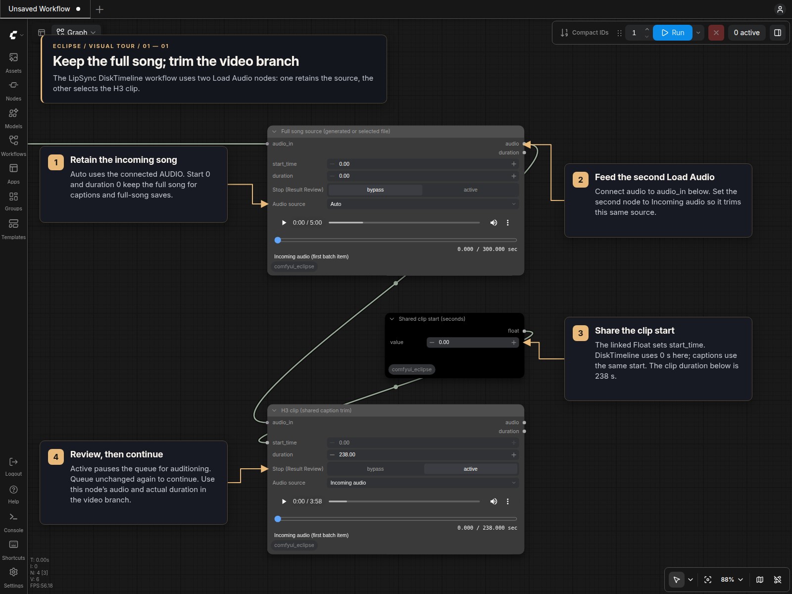

# Load Audio

Load Audio [Eclipse] selects an excerpt from an uploaded file or incoming AUDIO,
with an in-node player and an optional **Stop (Result Review)** control.

## Visual tour

This single example follows the two Load Audio nodes in the DiskTimeline
variant of [MiniMax H3 LipSync](https://civitai.com/models/2935228/minimax-h3-lipsync),
saved as
`MiniMaxH3_LipSync_V4_N2_Captions_DiskTimeline.json`. Keep the incoming song whole
in the first node, then select the video excerpt in the second.

1. Feed the incoming AUDIO into the first node's `audio_in`. **Auto** uses that
   input; `start_time = 0` and `duration = 0` retain the full song. Keep this
   node's `audio` output available for full-song saves and caption alignment.
2. Connect the first node's `audio` output to the second node's `audio_in` and
   choose **Incoming audio** there.
3. Connect **Shared clip start (seconds)** to the second node's `start_time`.
   DiskTimeline sets this Float to `0` and the second node's `duration` to
   `238` seconds. Share the start value with caption trimming so the video and
   captions select the same excerpt.
4. Enable **Stop (Result Review)** on the second node to audition the clip.
   Queue unchanged again to continue, using its `audio` and actual `duration`
   outputs for the video branch and its duration/planning consumers.

The screenshot uses a five-minute sample: the first player retains `300` seconds
and the second previews `238` seconds. Change the shared start and clip duration
to select another excerpt from your song.

## Source, trim and review controls

For generated songs, connect the generator's full AUDIO to both your full-song
Save Audio node and Load Audio's optional `audio_in`. If the save node passes
AUDIO through, you can connect that output to `audio_in` instead. Connect Load
Audio's trimmed AUDIO to lip-sync and **every audio duration/planning consumer**
in the video branch. Its second output reports the actual excerpt duration in
seconds. Saving the generator's output keeps the saved song full length.

1. Choose **Audio source**: **Auto**, **Selected file**, or **Incoming audio**.
   Select or upload a file when using the file source, and connect generated
   audio to `audio_in` if desired.
2. Set `start_time` and `duration` in seconds. A duration of `0` means to the end;
   an oversized duration stops at the end. Empty excerpts are rejected.
3. Enable **Stop (Result Review)** and queue. Load Audio executes even without a
   downstream consumer, publishes its preview, and stops downstream execution.
4. Audition the excerpt. Change start/duration and use the precise seek slider
   without queueing. The time display is relative to the excerpt. These edits
   change the preview immediately; they change downstream AUDIO on the next run.
5. Queue unchanged again to continue from the reviewed excerpt, or disable the
   stop and queue to release it to lip-sync.

Connected numeric primitives control the preview too: editing their value
refreshes the excerpt without queueing or starting video generation. Load Audio
follows numeric primitives, reroutes, Eclipse Set/Get, and resolvable subgraph
inputs/outputs, including promoted trim widgets. It restarts at the excerpt's
beginning and keeps the playing or paused state. Local trim widgets apply only
when their inputs are disconnected.

If a connected value needs backend computation, the player reports **Trim
requires execution**. After execution it can audition the last computed trim,
identified as coming from the last run; it does not substitute the hidden local
widget value. Changing the graph still requires a new run for computed values.

**Audio source** changes the player without queueing:

- **Auto** prefers incoming AUDIO. Muting the connected source restores the file
  controls and file preview while the cable stays connected. Bypassed sources
  use incoming audio when an AUDIO path remains; otherwise they fall back to the
  file. This also follows reroutes and Eclipse Set/Get connections.
- **Selected file** immediately previews the chosen file even with `audio_in`
  connected. On the next queue, Load Audio uses the file without requesting its
  upstream input. Other output nodes can still request that upstream branch.
- **Incoming audio** requires a usable input and reports when it is unavailable.
  It never silently selects the file.

The file dropdown and upload button are hidden while using incoming audio.
Switch to **Selected file** to choose or play a file at any time. Source and trim
changes affect downstream AUDIO on the next queue. New generated audio needs one
execution before its preview exists; previously generated audio can be auditioned
immediately. Custom routers whose output depends on execution may still need a
queue for automatic fallback; use **Selected file** to override them immediately.
Invalid incoming AUDIO raises an error instead of silently switching songs.

The source label identifies incoming audio or the selected fallback file.
Incoming previews contain the **full source**, so any excerpt can be auditioned
after one execution. A batch previews its first item; all batch items and channels
are preserved in the output. Browser previews use 16-bit PCM; the downstream
tensor retains its original samples, dtype and sample rate without resampling.

Incoming previews are temporary and are never used as a fallback song. Changing
the input connection clears the old preview. If a preview disappears after a
restart, queue again; the saved fallback selection and trim settings are retained.

An unchanged review queue can continue using ComfyUI's cache. Changed inputs
require review again; randomized seeds or upstream cache policies can regenerate
the song.
