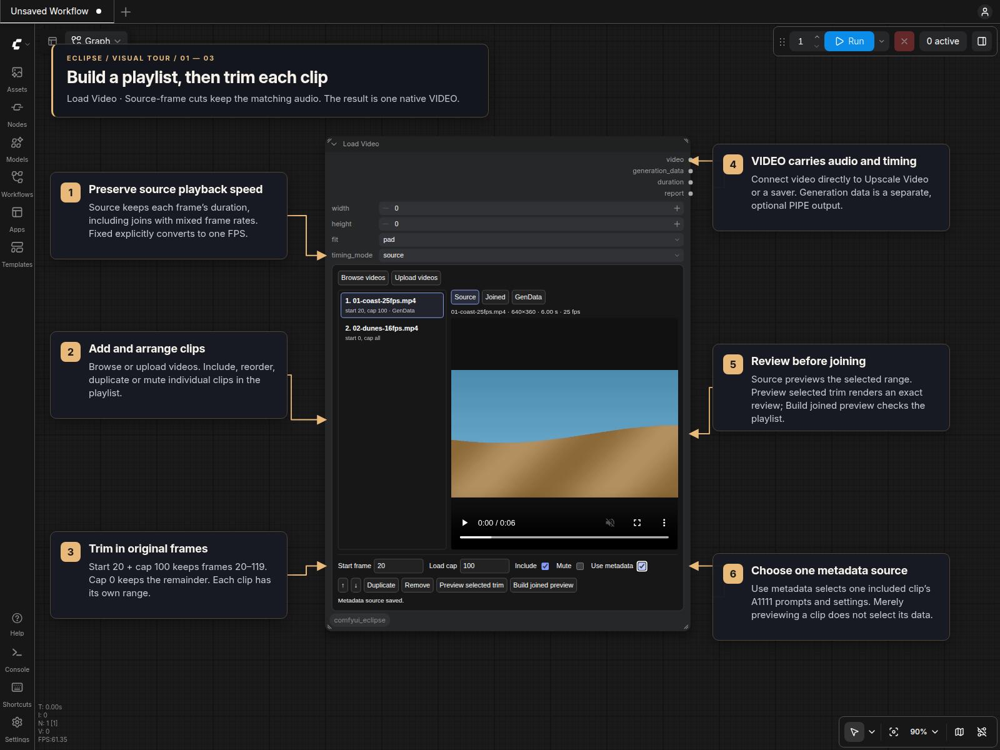
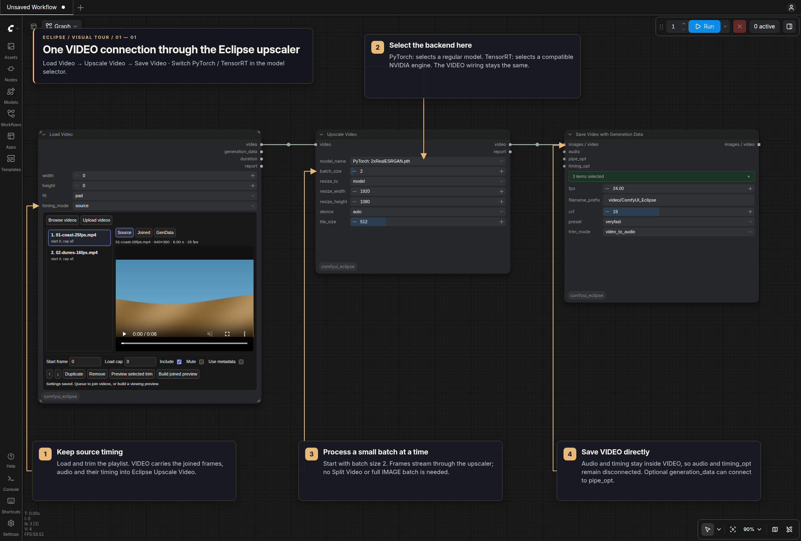
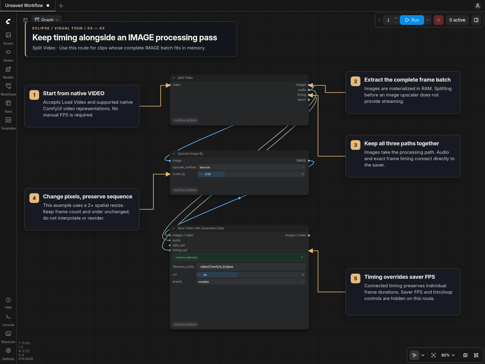

# Load Video and Split Video [Eclipse]

**Load Video** builds an ordered playlist with a player inside the node. Trim each
clip by its original frame numbers and join its audio with the same cuts into
native VIDEO. Find both nodes under **Eclipse → Video**.

## Visual tour

### Load Video: arrange and trim the playlist

The example uses two six-second sample clips at 25 and 16 FPS. The first keeps
100 frames starting at frame 20; the second keeps its full range. **Source**
timing retains each clip's playback speed. The metadata checkbox selects a
source, but only yields generation data when that file contains usable A1111
parameters.

### Direct video upscaling with Eclipse

Connect **Load Video → Upscale Video [Eclipse] → Save Video with Generation
Data** directly. The upscaler's model selector switches between PyTorch models
and compatible TensorRT engines while keeping the same VIDEO connections.
Audio and timing travel inside VIDEO; this route needs no splitter.

See the [direct Eclipse chain tour](Upscale_Video.md#direct-eclipse-video-chain-pytorch-or-tensorrt)
for backend requirements and the optional generation-data connection.

### Split Video: process images while retaining their timing

Connect the loader's `video` to Split Video. This example routes `images`
through a 2× spatial resize while `audio` and `timing` go directly to the saver.
Keep frame count and order unchanged. This route holds the complete IMAGE batch
in RAM; for long videos use the [streaming Upscale Video tour](Upscale_Video.md#visual-tour).

## Add and trim clips

1. Choose **Browse videos** for the dedicated Input/Output video grid, or **Upload
   videos** for multiple local files. Dropping local video files also uploads them.
2. Check files in the desired order and click **Add selected**. Searching, sorting,
   and changing folders keep the pending selection. Clicking a thumbnail previews
   that file without adding it or choosing its generation metadata.
3. Select a playlist row. **Start frame** is zero-based; **Load cap** is the number
   of source frames to retain. Both default to `0`: start at the beginning and
   retain every remaining frame. A cap beyond EOF retains the available frames;
   a start beyond EOF reports an error. Changing either value seeks the Source
   preview to the selected start; playback stops at the cap. This quick preview
   uses the clip's reported FPS. Use **Preview selected trim** for frame-exact
   review of variable-frame-rate sources.
4. Use **Include**, **Mute**, **Duplicate**, **Remove**, the arrow buttons, or drag
   rows to arrange the join. Disabled clips contribute neither frames nor audio.

For example, start `20`, cap `100` retains source frames `[20, 120)`. Every clip
has independent values, and its audio uses that exact time interval. Missing
audio, leading/trailing audio gaps, and muted clips become silence. The first
audio track is normalized to **48 kHz stereo**, without changing its tempo.

The editor exists immediately when the node is added. Playlist rows, trims,
metadata choice, active source, and pending browser selections are serialized
with the workflow and survive a page reload before the first queue. Uploads
must finish before their files can be added. A built preview is temporary and can
be rebuilt after a reload or expiry.

Resize the node to suit your workspace. Its outer size stays the same when you
change options or previews, and the saved size is restored with the workflow.

## Global size and timing

`width` and `height` apply to every clip. Both `0` use the first included clip's
displayed size. With one dimension `0`, it follows that clip's aspect ratio.
`pad` fits inside the size with black borders; `crop` fills and center-crops;
`stretch` fills both dimensions directly. Encoded VIDEO pads an odd dimension by
one edge pixel for H.264.

`timing_mode = source` preserves each frame's presentation duration. Joining one
second at 25 FPS with one second at 16 FPS produces **41 frames over 2 seconds**.
The 16 FPS section keeps its original playback speed. The resulting VIDEO has
variable frame timing.

`timing_mode = fixed` exposes `fps` and duplicates/drops frames on that output
grid. Its last frame may extend the result by less than one output frame; audio
is padded to that boundary. The `duration` output describes this encoded result.

## Preview and outputs

**Source** plays the original file within the selected range. Editing a trim
returns to that clip even when a joined result or browser thumbnail was being
previewed. **Preview selected trim** and **Build joined preview** explicitly
render a playable MP4, shown under **Joined**. Editing the
playlist marks that result stale. **Cancel preview** stops an active request.
Browsing, inspecting metadata, and restoring a workflow never encode a video.

Queuing always produces VIDEO, including the joined audio. For separate images
or audio, connect **Split Video** or ComfyUI's **Get Video Components**.

| Output | Contents |
| --- | --- |
| `video` | Native file-backed VIDEO with the chosen timing and soundtrack. |
| `generation_data` | Prompt/sampling PIPE from the selected metadata source, or `None`. |
| `duration` | Duration of the joined VIDEO in seconds. |
| `report` | Per-file media properties, ranges, A1111 text, parsing status, and result details. |

Frame counts remain in the report. A count node can also read extracted images.

## Upscale before saving

For long videos, connect:

`Load Video → Upscale Video → Save Video with Generation Data`

[Upscale Video](Upscale_Video.md) includes model selection, a bounded batch size,
PyTorch support for non-NVIDIA devices, and optional TensorRT engines. Audio and
source timing stay inside VIDEO. Connect `generation_data` directly to the
saver's `pipe_opt` if wanted; leave `audio` and `timing_opt` disconnected.

For shorter videos that fit in RAM, connect `video` to **Split Video**, then:

- `images` → image upscaler → **Save Video with Generation Data** `images / video`
- `audio` → saver `audio`
- `timing` → saver `timing_opt`
- optionally, Load Video's `generation_data` → saver `pipe_opt`

Connected timing overrides the saver's FPS, trim, and loop settings; those controls
are hidden while it is connected. This preserves mixed frame rates through a
spatial upscale. Frame count and order must remain unchanged. The saver rejects
a different count; it cannot detect a reorder with the same count. Selection,
interpolation, duplication, or temporal trimming needs matching timing/audio
changes and is not supported by this connection.

**Split Video** provides IMAGE, AUDIO, and timing outputs for VIDEO from
this loader or ComfyUI's built-in nodes. It has one VIDEO input and no manual FPS
or timing input. File-based videos retain their timestamps and native trim/crop
views; component videos use their stored frame rate. Native concatenations are
handled clip by clip. Unsupported third-party VIDEO representations report an
error rather than guessing their timing. `report` describes the extraction.
The splitter materializes the complete IMAGE batch; using it before an ordinary
image upscaler does not provide streaming or solve the full-video RAM limit.

ComfyUI's **Get Video Components** also exposes images and audio, plus a single
FPS value. It works for ordinary constant-rate workflows. For a join with mixed
frame rates, use Split Video's `timing` connection to preserve the individual
frame durations through an IMAGE processing pass.

## A1111 generation metadata

**Use metadata** selects at most one included clip as the downstream source.
Selecting another clears the previous choice. Preview selection is independent;
duplicating a row does not copy this flag, and excluding its row clears it.

Only the container's A1111 `parameters` tag, as written by **Save Video with
Generation Data** for Civitai, is read. The PIPE contains positive/negative
prompts and available sampling settings: seed, steps, CFG, sampler, scheduler,
denoise, CLIP skip, and dimensions. Model, VAE, LoRA, embedding, and hash fields
are not restored. Workflow graphs and JSON sidecars are not read.

**GenData** previews the active clip's parsed prompts/settings. If the selected
source has no usable A1111 tag, the PIPE is `None`; another clip is never selected
automatically. The debug `report` includes bounded original A1111 text, which can
contain resource names that were excluded from the PIPE.

## Resource use and limits

VIDEO frames stream into a temporary H.264 MP4. Audio is held as joined PCM;
the loader checks available RAM for audio and frame processing. Exact frame
ranges require an initial timestamp scan. Cached scans and still-live media can
be reused when only the metadata choice changes.

Extracting images with a component node requires a complete batch in RAM:
approximately `frames × width × height × 3 × 4` bytes before downstream upscaling.

Loading decodes SDR frames to 8-bit RGB. HDR and alpha inputs require
explicit conversion/compositing first. Source timing is preserved, but compressed
pixels are not bit-identical: VIDEO is encoded, and a saver can encode it again.
Use the streaming Upscale Video route for longer videos. Joined previews also
render at the configured size.

The initial scope is hard joins of up to 128 videos. It does not include
transitions, motion interpolation, speed changes, multiple soundtrack mixing,
remote URL downloads, or image slideshows. Original source files are unchanged.
