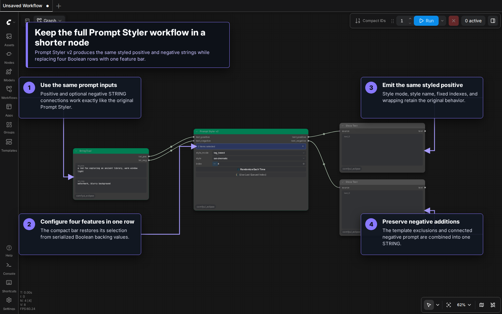
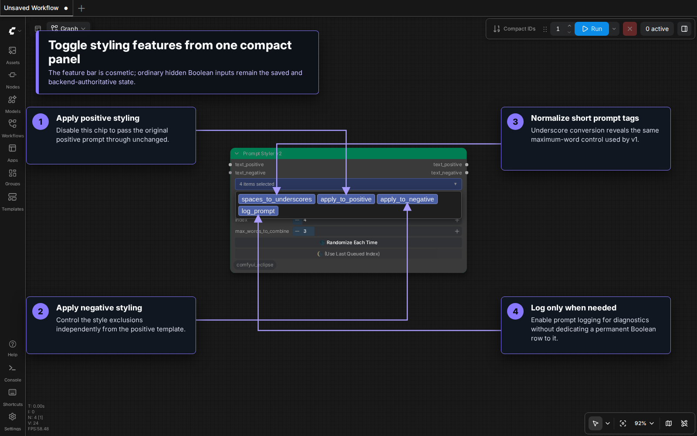
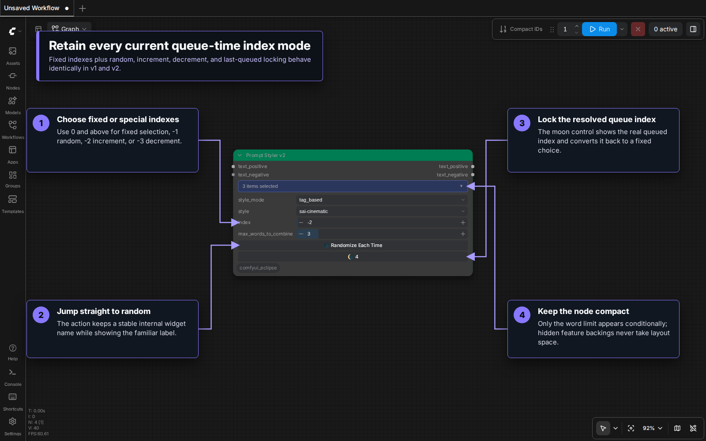

# Prompt Styler v2 Guide

**Prompt Styler v2** keeps the original Prompt Styler's style libraries, index modes, and two `STRING` outputs while replacing four Boolean rows with one compact feature-chip bar. It is a separate node, so existing Prompt Styler workflows continue to use v1 without migration.

For the original node's full style-library and custom-file reference, see the [Prompt Styler guide](Prompt_Styler.md).

## Visual Tour

### Keep the same workflow in a shorter node

Connect a positive prompt and, optionally, an existing negative prompt. V2 applies the same selected template as v1 and emits the same positive and negative strings, while its feature settings occupy one compact row.

### Configure feature chips

Click the feature bar to toggle any combination of its four chips. The selections are restored when the workflow reloads. Enabling `spaces_to_underscores` reveals `max_words_to_combine`; disabling it hides that control again.

### Automate queue-time style selection

Fixed indexes and the current special modes behave exactly as they do in v1: `-1` randomizes, `-2` increments, and `-3` decrements. The moon control displays the last real queued index and can lock it back into a fixed selection.

## Quick Start

1. Add **Prompt Styler v2** from the node menu.
2. Connect `text_positive` and, optionally, `text_negative`.
3. Choose `tag_based`, `natural_language`, or `custom`, then select a style.
4. Open the feature bar to adjust positive styling, negative styling, underscore conversion, or logging.
5. Connect the two styled `STRING` outputs to the rest of the workflow.

## Inputs and Outputs

| Control | Type | Default | Description |
|---|---|---:|---|
| `text_positive` | STRING | — | Required base positive prompt. |
| `style_mode` | COMBO | `tag_based` | Selects the tag-based, natural-language, or custom style library. |
| `style` | COMBO | First available style | Chooses a style from the active library. |
| `index` | INT | `0` | Selects a zero-based style index; accepts `-3` through `999999`. |
| Feature bar | Multi-select | Positive and negative styling | Opens the four compact feature chips described below. |
| `max_words_to_combine` | INT | `3` | Maximum words in a comma-separated segment eligible for underscore conversion; visible only while that feature is active. |
| `text_negative` | STRING | Empty | Optional negative prompt combined with the style's negative text. |

The outputs are `text_positive` and `text_negative`, both ordinary `STRING` values. The chip bar itself is a visual control and is not sent to the backend. Hidden socketless Boolean inputs save each chip selection and remain authoritative when the node is executed without the frontend.

## Feature Chips

| Chip | Default | Behavior |
|---|---:|---|
| `spaces_to_underscores` | Off | Replaces spaces in short comma-separated prompt segments with underscores. |
| `apply_to_positive` | On | Applies the selected style template to the positive prompt. When off, the positive prompt passes through unchanged. |
| `apply_to_negative` | On | Adds the selected style's negative text. When off, only the supplied negative prompt is emitted. |
| `log_prompt` | Off | Logs the styled prompt pair for diagnostics. |

All four chips may be disabled. This preserves the input prompts while leaving style and index controls available for later use.

## Style and Index Selection

The `style` dropdown and `index` remain synchronized. Non-negative indexes select a fixed entry and wrap at the active library boundary.

| Index | Queue-time behavior |
|---:|---|
| `0` and above | Use the wrapped fixed style index. |
| `-1` | Pick a random style for each queue. |
| `-2` | Use the displayed style, then advance on subsequent queues. |
| `-3` | Use the displayed style, then move backward on subsequent queues. |

**Randomize Each Time** is a shortcut for `-1`. After queueing a special mode, use the moon control to replace it with the resolved fixed index. Shuffle-without-repeat (`-4`) is not part of this version.

## Compatibility

- The serialized node ID is `Prompt Styler v2 [Eclipse]`; its display name is **Prompt Styler v2**.
- The original `Prompt Styler [Eclipse]` remains registered and unchanged. Existing workflows are not converted automatically.
- V1 and v2 share the same styles, style endpoint, queue-time index resolution, and backend style application.
- Custom CSV and JSON style files work in both versions. See [Creating Custom Styles](Prompt_Styler.md#creating-custom-styles) for formats and locations.

## Troubleshooting

**The word-limit control is missing:** Enable the `spaces_to_underscores` chip. It is intentionally hidden at all other times.

**A saved workflow shows different chips:** Check the workflow's stored Boolean backing values. They are the saved source of truth, and the visual bar rebuilds its selection from them during load.

**The style changes when queueing:** Check `index`. Use `0` or above for a fixed selection; `-1`, `-2`, and `-3` are queue-time modes.

**I need the original row-based controls:** Add **Prompt Styler** rather than **Prompt Styler v2**. Both nodes remain available.
