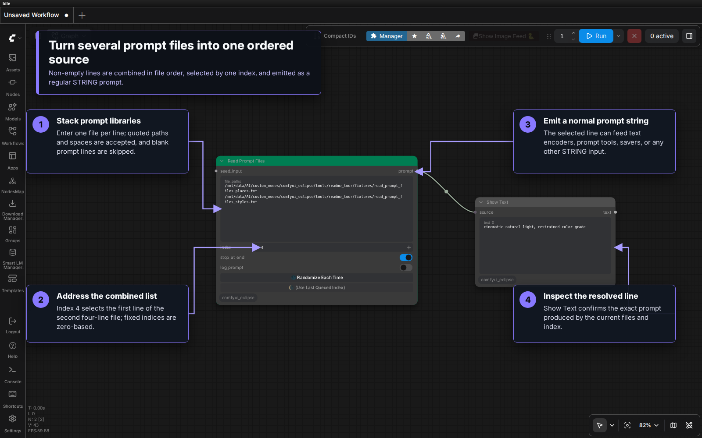
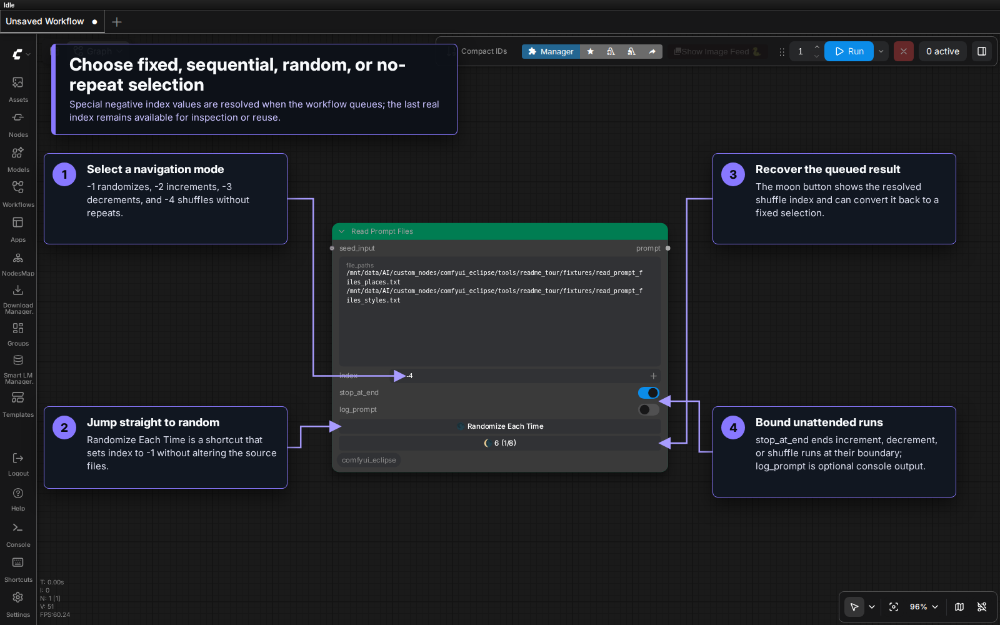
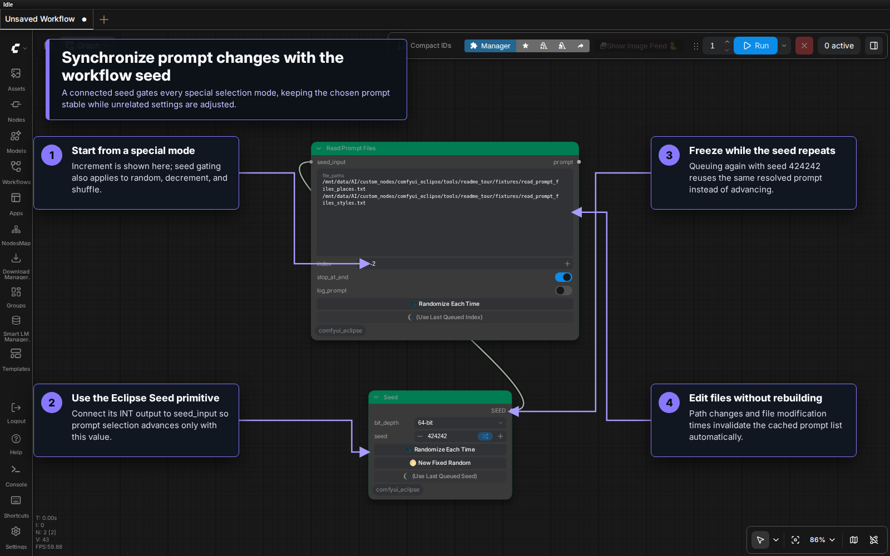

# Read Prompt Files

`Read Prompt Files [Eclipse]` turns the non-empty lines from one or more text files into a single indexed prompt source. Use a fixed index for repeatable selection, a negative index mode for automatic navigation, or connect `seed_input` to synchronize prompt changes with the rest of a workflow.

## Visual tour

### Combine files and select one prompt



Files are read from top to bottom in the order listed in `file_paths`. Their non-empty lines form one zero-based sequence. In the example, two four-line files produce indices `0–7`, so index `4` selects the first line from the second file.

The `prompt` output is a regular `STRING`. It can connect directly to text encoders, prompt processors, save nodes, or any other compatible input. `Show Text [Eclipse]` is used above only to make the resolved line visible.

### Navigate automatically



The `index` widget accepts fixed positions and four queue-time modes:

| Index | Mode | Queue behavior |
| ---: | --- | --- |
| `0+` | Fixed | Reuses that zero-based prompt position. |
| `-1` | Random | Selects any prompt on every eligible queue. |
| `-2` | Increment | Starts at the beginning and advances through the combined list. |
| `-3` | Decrement | Starts at the end and moves backward. |
| `-4` | Shuffle | Selects random prompts without repeats until every prompt has been used. |

The frontend resolves a negative mode to a real index before sending the prompt to the backend. The moon button then displays that queued index; click it to turn the resolved result into a fixed selection.

`Randomize Each Time` is a shortcut for setting `index` to `-1`. It does not create a fixed random index.

With `stop_at_end` enabled, increment, decrement, and shuffle stop workflow processing and disable iteration when they reach their boundary. Disable it to continue with another cycle. Random mode is not bounded by this setting.

### Synchronize selection with a seed



Connect an integer source such as `Seed [Eclipse]` to `seed_input` when prompt selection should change only when the workflow seed changes. This applies to random, increment, decrement, and shuffle modes. Re-queueing with the same seed keeps the previously resolved prompt stable while you adjust unrelated settings.

## Inputs and output

| Name | Type | Description |
| --- | --- | --- |
| `file_paths` | `STRING` | One text-file path per line. Matching single or double quotes around a path are removed automatically. |
| `index` | `INT` | A fixed zero-based position or one of the four negative navigation modes above. |
| `stop_at_end` | `BOOLEAN` | Stops bounded navigation when increment, decrement, or shuffle is exhausted. Default: enabled. |
| `log_prompt` | `BOOLEAN` | Writes the selected prompt to the ComfyUI console. Default: disabled. |
| `seed_input` | `INT`, optional input | Gates special-mode advancement by the connected value. |
| `prompt` | `STRING` output | The selected non-empty line. |

## File handling

Enter one file per line:

```text
/path/to/prompts/subjects.txt
"/path/with spaces/styles.txt"
/path/to/prompts/lighting.txt
```

- Blank path rows and blank prompt lines are ignored.
- Paths must resolve to readable files on the ComfyUI server.
- Lines are not split as CSV; each complete non-empty line is one prompt.
- Editing a listed file changes its modification time and invalidates the cached list automatically.
- Adding, removing, or reordering paths also rebuilds the combined sequence.
- ComfyUI's refresh action explicitly invalidates the active file list and updates the maximum fixed index.

## Common setups

Sequential generation:

1. List the prompt files in the desired order.
2. Set `index` to `-2`.
3. Leave `stop_at_end` enabled for a finite run, or disable it to loop.

Stable seed-driven variation:

1. Set `index` to `-1` or `-4`.
2. Connect the same seed source used by the sampling branch to `seed_input`.
3. Change the seed when a new prompt should be selected; keep it fixed while tuning other values.

Targeted reuse:

1. Queue a random or navigation mode.
2. Note the index shown on the moon button.
3. Click the button to keep that exact prompt as a fixed index.

## Troubleshooting

- An empty output usually means no listed path resolved to a readable file or every file was empty.
- If a fixed index exceeds the available range, the backend clamps it to the nearest valid prompt.
- When file contents change but the visible maximum has not updated yet, use ComfyUI's refresh action.
- Enable `log_prompt` only when the complete selected prompt may safely appear in the server console.
