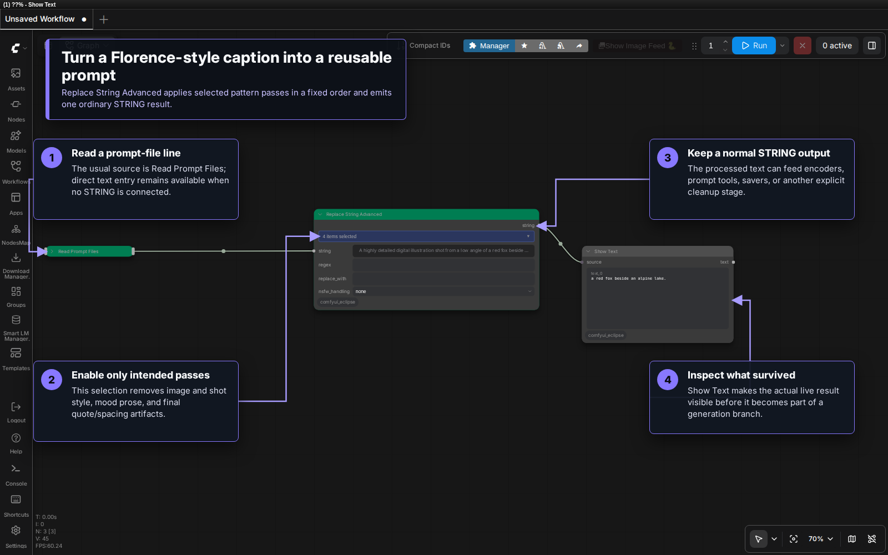
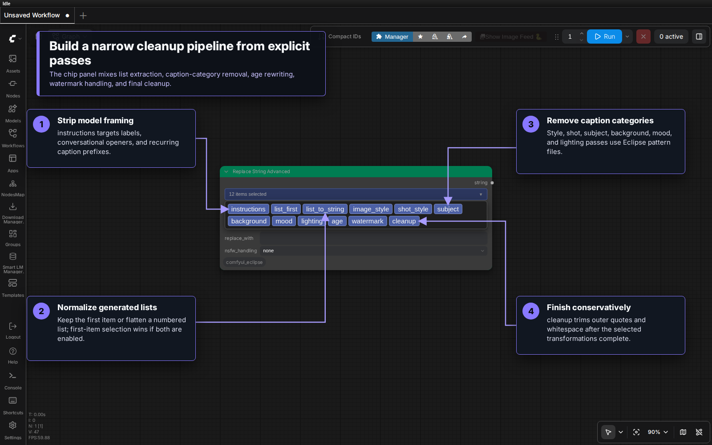
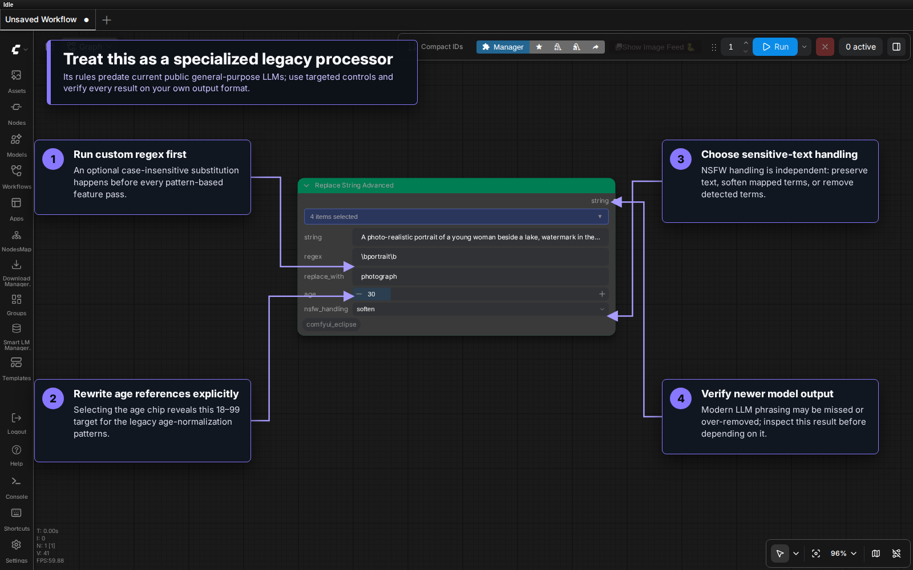

# Replace String Advanced

Replace String Advanced is a pattern-based text processor for cleaning and reshaping generated captions before they enter the rest of a prompt workflow.

> [!CAUTION]
> This is a specialized legacy processor. It can process text from Florence-2 and other LLMs, but most built-in terms and phrase patterns were fitted to recurring Florence-2-style captions before the current generation of public general-purpose LLMs. Other models may phrase the same ideas differently, so a pass can miss text or remove more than intended. Always inspect the result with your own model and prompt format.

The node may be deprecated or removed in the future. For new workflows, depend on it only when its deterministic rules have been tested against the exact text source you use.

Existing workflows remain compatible. The user-facing node and this guide are named **Replace String Advanced**.

## Visual tour

### Standard prompt-file pipeline



Common connections include:

```text
Read Prompt Files → Replace String Advanced → prompt consumer
Smart LM Loader  → Replace String Advanced → prompt consumer
```

Connect the `prompt` output from [Read Prompt Files](ReadPromptFiles.md), or a text result from [Smart LM Loader](https://github.com/r-vage/ComfyUI_SmartLLM), to the `string` input. A direct value can also be entered into `string` when it is not connected. During setup, use **Show Text** or another preview node to verify the processed output before sending it to an encoder, saver, or generation branch.

### Feature selection



The feature bar is serialized as one ordered selection. Enable only the passes needed for the current caption format; selecting every chip is not a safer default.

### Specialized controls and output verification



Custom regex runs before the pattern passes. Age rewriting appears only when the `age` chip is selected. `nsfw_handling` is independent of the chip selection and should also be verified against the input format.

## Inputs and output

| Name | Type | Purpose |
|---|---|---|
| `string` | STRING | Caption or prompt text. Commonly connected from Read Prompt Files or Smart LM Loader; manual entry is also supported. |
| `regex` | STRING | Optional case-insensitive regular expression applied first. Leave empty to skip it. |
| `replace_with` | STRING | Replacement text used by `regex`. |
| `features` | combo chips | Pattern-based passes to run. |
| `age` | INT | Target age from 18 to 99. Visible only when the `age` feature is selected. |
| `nsfw_handling` | COMBO | `none`, `soften`, or `remove`. |
| `string` | STRING output | The processed text. |

## Feature chips

| Chip | What it attempts to do |
|---|---|
| `instructions` | Remove recurring labels, conversational openers, and model framing such as `Prompt:` or `Description:`. |
| `list_first` | Extract the first item from a recognized numbered or bulleted list. |
| `list_to_string` | Flatten recognized list items into one comma-separated string. |
| `image_style` | Remove image-medium, style-prefix, and quality phrasing recognized by the Eclipse patterns. |
| `shot_style` | Remove recognized camera-angle and shot-type wording. |
| `subject` | Remove recognized person or subject descriptions. |
| `background` | Remove recognized background, setting, and environment descriptions. |
| `mood` | Remove recognized mood and atmosphere descriptions. |
| `lighting` | Remove recognized lighting descriptions. |
| `age` | Rewrite recognized age phrases to the selected target age. |
| `watermark` | Remove recognized phrases containing watermark descriptions. |
| `cleanup` | Trim surrounding whitespace and matching outer quotation marks. |

If both list features are selected, `list_first` takes precedence over `list_to_string`.

## Processing order

The node applies enabled work in a fixed sequence:

1. Custom `regex` replacement.
2. Age rewriting.
3. Instruction and list-pattern detection.
4. Image-style prefix removal for prose.
5. Word-level category detection.
6. Sentence-level background, mood, and lighting detection for prose.
7. NSFW softening or removal.
8. Overlap-aware removal of detected spans.
9. First-item extraction or list flattening.
10. Final `cleanup`.

This order matters. For example, a regex substitution changes the text seen by every later pass, and cleanup does not run until the selected transformations finish.

## Florence-2 example

Input from a caption file:

```text
A highly detailed digital illustration shot from a low angle of a red fox beside an alpine lake. The overall atmosphere is serene and dreamlike.
```

With `image_style`, `shot_style`, `mood`, and `cleanup` selected, the current rules can reduce it to:

```text
a red fox beside an alpine lake.
```

That result is useful because the source follows the sentence patterns this node was designed around. Other LLM outputs can also be processed, but their wording may not match the Florence-2-fitted term lists as completely. Structured JSON and tool-call output should use purpose-built parsing instead.

## Tags and prose are handled differently

The processor estimates whether the input is tag-like or prose-like. Signals include Danbooru-style subject tags, comma count, and sentence punctuation.

- Tag-like text uses word-level matching for all removal categories.
- Prose uses sentence-level matching for background, mood, and lighting, plus prefix-oriented image-style removal.

This heuristic is another reason to preview the output. Mixed formats can be classified unexpectedly.

## Regex replacement

`regex` and `replace_with` provide one custom substitution before the built-in rules.

| Regex | Replacement | Effect |
|---|---|---|
| `\bportrait\b` | `photograph` | Replace the whole word `portrait`. |
| `\s+` | one space | Collapse repeated whitespace. |
| `\d+` | `X` | Replace runs of digits. |

The replacement is case-insensitive. Invalid expressions are reported by the node; test complex patterns separately before using them in an unattended queue.

## Age and sensitive-text handling

Selecting the `age` chip reveals an 18–99 target. The legacy patterns rewrite recognized phrases such as explicit year counts or broad age descriptions. Because age wording varies widely, inspect the result for awkward duplication or missed references.

`nsfw_handling` has three modes:

| Mode | Behavior |
|---|---|
| `none` | Preserve the text. |
| `soften` | Replace recognized explicit terms with mapped softer wording. |
| `remove` | Remove recognized explicit terms. |

These modes are pattern based, not semantic moderation. They do not guarantee that every sensitive phrase is found or that the remaining sentence is grammatically complete.

## Recommended use

- Feed it a known caption family from Florence-2, Smart LM Loader, or another LLM.
- Expect the strongest built-in pattern coverage around Florence-2-style prose.
- Start with one or two feature chips and compare before/after text.
- Keep Show Text attached while designing the workflow.
- Re-test after changing the upstream caption model or prompt template.
- Prefer purpose-built parsing for JSON, schemas, or modern model-specific response formats.
- Avoid treating the node as a general safety filter or universal LLM cleanup stage.

## Related documentation

- [Read Prompt Files](ReadPromptFiles.md) — select prompt lines from one or more files.
- [ComfyUI SmartLLM](https://github.com/r-vage/ComfyUI_SmartLLM) — provides Smart LM Loader and its LLM/VLM text outputs.
- [Smart Prompt](Smart_Prompt.md) — assemble deterministic prompt variations from text libraries.
- [Save Prompt](Save_Prompt.md) — save prompt text alongside generated results.
- [Wildcard Processor](Wildcard_Processor.md) — expand wildcard-driven prompt text.
