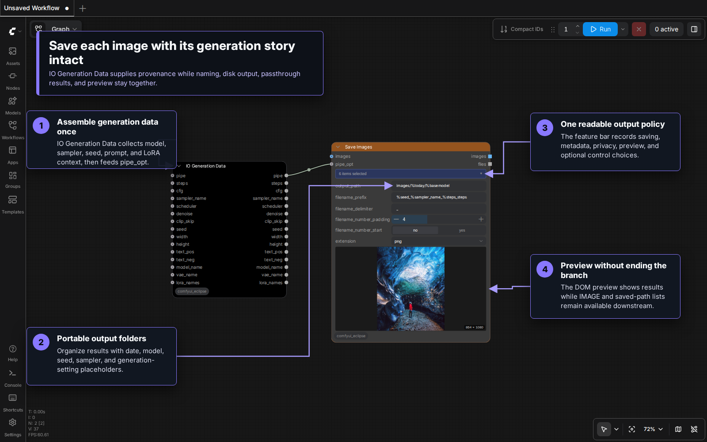
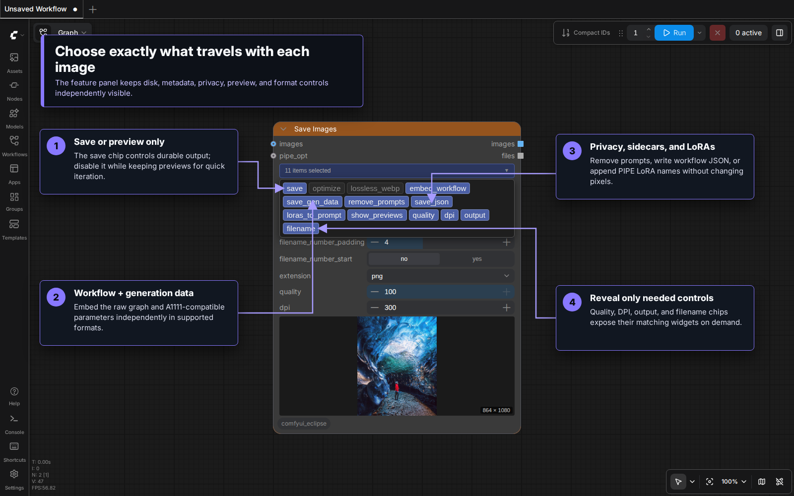
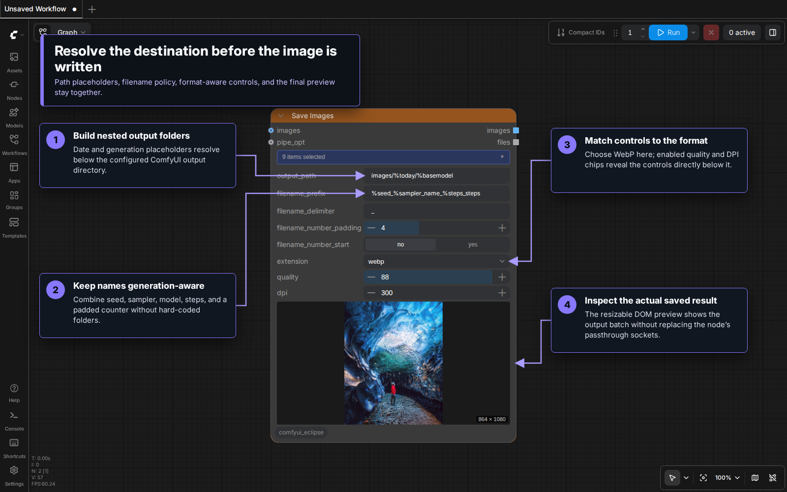

# Save Images [Eclipse]

A feature-rich output node for saving images with CivitAI-compatible metadata, combo-chip feature toggles, placeholder-based file organization, and 7 output formats.

## Table of Contents
- [Overview](#overview)
- [Visual Tour](#visual-tour)
- [Combo-Chip Features](#combo-chip-features)
- [Inputs](#inputs)
- [Placeholder System](#placeholder-system)
- [Output Formats](#output-formats)
- [Metadata Embedding](#metadata-embedding)
- [Preview-Only Mode](#preview-only-mode)
- [Pipe Integration](#pipe-integration)
- [Outputs](#outputs)
- [Usage Examples](#usage-examples)
- [Tips & Best Practices](#tips--best-practices)

---

## Overview

Save Images replaces the original Save Images node with a modern combo-chip interface. Instead of a long list of toggles, feature chips control which options are visible. The node handles image saving, metadata embedding, workflow preservation, and CivitAI-compatible generation data — all controlled by toggling chips on or off.

### Key Capabilities

- **Combo-chip feature toggles** — show only the settings you need
- **7 output formats** — PNG, JPG, JPEG, GIF, TIFF, WebP, BMP
- **CivitAI-compatible metadata** — A1111-style parameters with model/LoRA/embedding hashes
- **Placeholder system** — dynamic paths and filenames (%today, %seed, %model, etc.)
- **Preview-only mode** — display without saving to disk
- **Pipe integration** — extract metadata from upstream pipe connections
- **Workflow embedding** — save full workflow in PNG/WebP metadata

---

## Visual Tour

### Save images with generation provenance

Connect images directly and route the output of **IO Generation Data** into
`pipe_opt`. The PIPE keeps model, sampler, scheduler, seed, prompt, LoRA, and
other generation context available to the same node that resolves filenames,
writes images, previews results, and passes image and file lists downstream. IO
Generation Data is shown because it makes those fields explicit, but `pipe_opt`
accepts all Eclipse PIPE outputs that use the shared context contract.



### Choose the attached data and output policy

Open the feature bar to control disk saving, workflow and generation metadata,
prompt privacy, JSON sidecars, LoRA prompt insertion, preview visibility, and
optional output controls. Each selection is restored with the workflow through
the node's hidden socketless backing values.



### Resolve paths, format, and preview

The `output` and `filename` chips expose placeholder-aware destination fields.
The `quality` and `dpi` chips reveal their controls only when needed; format
selection and the resizable DOM preview remain in the same node.



---

## Combo-Chip Features

The node uses a combo-chip widget to toggle feature groups. Fresh nodes enable `save`, `embed_workflow`, `save_gen_data`, `show_previews`, `output`, and `filename`.

| Chip | Default | Controls |
|------|---------|----------|
| `save` | **on** | Save images to disk (disable for preview-only mode) |
| `optimize` | off | Image optimization flag |
| `lossless_webp` | off | Lossless WebP compression |
| `embed_workflow` | **on** | Embed workflow in image metadata (PNG/WebP) |
| `save_gen_data` | **on** | Embed A1111-compatible generation data |
| `remove_prompts` | off | Strip prompts from embedded metadata |
| `save_json` | off | Save workflow as separate JSON file |
| `loras_to_prompt` | off | Append LoRA names and weights to prompt metadata |
| `show_previews` | **on** | Show image preview in UI |
| `output` | **on** | Show custom output path widget |
| `filename` | **on** | Show custom filename prefix widget |
| `quality` | off | Show quality slider |
| `dpi` | off | Show DPI setting |

Chips control widget **visibility** — disabled chips hide their associated inputs to keep the node compact.

---

## Inputs

### Image Sources

| Input | Type | Required | Description |
|-------|------|----------|-------------|
| `images` | IMAGE | Optional | Direct image input |
| `pipe_opt` | PIPE | Optional | Pipe for metadata extraction |

Either `images` or `pipe_opt` (or both) can be connected. When both are present, images come from `images` and metadata from the pipe.

### File Settings

| Input | Type | Default | Description |
|-------|------|---------|-------------|
| `output_path` | STRING | `%Y-%M-%D\%basemodel` | Subfolder path (supports placeholders) |
| `filename_prefix` | STRING | `%basemodel, %seed...` | Filename prefix (supports placeholders) |
| `filename_delimiter` | STRING | `_` | Character between prefix and counter |
| `filename_number_padding` | INT | 4 | Counter zero-padding (1–9) |
| `filename_number_start` | BOOLEAN | False | Put counter at start of filename |
| `extension` | COMBO | `png` | Output format (png, jpg, jpeg, gif, tiff, webp, bmp) |

### Conditional Settings (visible when chip is enabled)

| Input | Type | Default | Chip Required |
|-------|------|---------|---------------|
| `quality` | INT | 100 | `quality` |
| `dpi` | INT | 300 | `dpi` |

---

## Placeholder System

Both `output_path` and `filename_prefix` support placeholders that are replaced with actual values at save time. Unknown or empty placeholders fall back to readable defaults.

### Available Placeholders

| Placeholder | Description | Example |
|-------------|-------------|---------|
| `%today`, `%date` | Current date | 2025-09-27 |
| `%time` | Current time | 143052 |
| `%Y` | Year | 2025 |
| `%m`, `%M` | Month | 09 |
| `%d`, `%D` | Day | 27 |
| `%H` | Hour | 14 |
| `%S` | Second | 52 |
| `%basemodel` | Base model name | juggernaut_aftermath |
| `%model` | Full model name | juggernaut_aftermath_v5 |
| `%seed` | Generation seed | 12345 |
| `%sampler_name` | Sampler used | euler |
| `%scheduler` | Scheduler | karras |
| `%steps` | Step count | 20 |
| `%cfg` | CFG scale | 7.5 |
| `%denoise` | Denoise strength | 1.0 |
| `%clip_skip` | CLIP skip value | -2 |

### Examples

**Organized by date and model:**
```
output_path:     %Y-%M-%D/%basemodel
filename_prefix: %seed_%sampler_name_%steps
```
Result: `2025-09-27/FluxDev/12345_euler_20_0001.png`

**Simple date-based:**
```
output_path:     %today
filename_prefix: img
```
Result: `2025-09-27/img_0001.png`

---

## Output Formats

| Format | Metadata | Quality Control | Notes |
|--------|----------|-----------------|-------|
| **PNG** | Workflow + gen data | Lossless | Best for ComfyUI workflow preservation |
| **WebP** | Workflow + gen data | Quality + lossless option | Good compression, full metadata |
| **JPG/JPEG** | EXIF only | Quality slider | Lossy, no workflow embedding |
| **TIFF** | Basic | Lossless | Large files |
| **GIF** | None | N/A | Limited to 256 colors |
| **BMP** | None | N/A | Uncompressed |

---

## Metadata Embedding

### Generation Data (`save_gen_data` chip)

When enabled, the node embeds A1111-compatible generation data:

- **Positive prompt** — from pipe or workflow
- **Negative prompt** — from pipe or workflow
- **Generation parameters** — steps, sampler, scheduler, CFG, seed, size, model
- **Model hash** — SHA256 short hash for CivitAI compatibility
- **LoRA hashes** — extracted from prompt, hashed for CivitAI
- **Embedding hashes** — extracted from prompt, hashed for CivitAI

The metadata follows CivitAI's expected format so images uploaded there will show full generation details.

### Workflow Embedding (`embed_workflow` chip)

When enabled:
- Full ComfyUI workflow saved in PNG text chunks or WebP metadata
- Drag saved images back into ComfyUI to restore the entire workflow
- Only applies to **PNG** and **WebP** formats

### Additional Options

| Chip | Effect |
|------|--------|
| `remove_prompts` | Strip positive/negative prompts from metadata (privacy) |
| `loras_to_prompt` | Append LoRA names and weights to the prompt field in metadata |
| `save_json` | Save workflow as a separate `.json` file alongside the image |

---

## Preview-Only Mode

Disable the **save** chip to use preview-only mode:

- Images are saved to a temporary folder for UI display only
- No metadata processing or hashing is performed
- Significantly faster than full save mode
- Useful for quick iteration before committing to disk

Enable preview-only: turn off `save`, `output`, and `filename`, then keep `show_previews` on. (`output` or `filename` automatically re-enables saving.)

---

## Pipe Integration

Connect any Eclipse PIPE output to `pipe_opt`. Save Images reads the
known values present in that context and safely falls back for fields the pipe
does not contain. **IO Checkpoint Loader** is a particularly useful single-source
connection because its PIPE already provides most of the values recorded by Save
Images; **IO Generation Data** is useful when you want to assemble or override
the saved generation fields explicitly.

### Preserve assets from multiple workflow stages

Saved generation data is not limited to the final sampling stage. Save Images
can record all models, VAEs, and LoRAs used across a multi-stage workflow when
their names are collected upstream:

1. Use a separate **Merge Strings** (`Merge Strings [Eclipse]`) node for the
   model names, VAE names, and LoRA names produced by the different stages.
2. Keep `return_as_list` off and use the default `, ` delimiter.
3. Connect the three merged strings to `model_name`, `vae_name`, and
   `lora_names` on **IO Generation Data**.
4. Connect the IO Generation Data PIPE output to Save Images `pipe_opt`.

```text
stage 1 model name ─┐
stage 2 model name ─┼─→ Merge Strings ─→ IO Generation Data: model_name
stage 3 model name ─┘

repeat for VAE and LoRA names
                              IO Generation Data: pipe ─→ Save Images: pipe_opt
```

Save Images deduplicates the merged model and VAE names and processes every
entry for the saved metadata. It also deduplicates and records every merged
LoRA; LoRA strings may include weights such as `<lora:detailer:0.7>`. This keeps
the image's provenance complete instead of describing only the last stage.

The node can automatically extract metadata such as:

- Model name, VAE name, LoRA names
- Sampler settings (sampler, scheduler, steps, CFG, seed)
- Prompts (positive and negative)
- Dimensions and other generation parameters

The pipe provides values for placeholder resolution and metadata embedding. Without a pipe, the node extracts available data from the ComfyUI workflow prompt.

### Compatible Pipe Sources

| Source Node | What It Provides |
|-------------|------------------|
| **IO Checkpoint Loader** | A broad checkpoint context containing most values used by saved metadata and filename placeholders |
| **Smart Model Loader** | Model name, VAE name, LoRA names, sampler settings, dimensions, prompts, seed |
| **Smart Sampler Settings** | Sampler, scheduler, steps, CFG, denoise, seed |
| **Smart Folder** | Output path, dimensions, batch size |
| **IO Context Image** | Full context — model info, images, conditioning, prompts, sampler, path |
| **IO Generation Data** | Generation metadata — steps, cfg, sampler, scheduler, denoise, prompts, model/vae/lora names |
| **Concat Pipe Multi** | Merged pipe from any combination of the above |

Use **Concat Pipe Multi** to combine multiple pipe sources into one before connecting to `pipe_opt` — for example, merge a Smart Model Loader pipe with a Smart Sampler Settings pipe to provide both model info and sampler settings.

---

## Outputs

| Output | Type | Description |
|--------|------|-------------|
| `images` | IMAGE | Passthrough of input images |
| `files` | STRING list | Saved file paths in image order |

---

## Usage Examples

### Basic Save with Metadata

1. Connect image output to `images`
2. Enable chips: `save`, `embed_workflow`, `save_gen_data`, `output`, `filename`
3. Set `output_path` to `%today/%basemodel`
4. Set `filename_prefix` to `%seed`
5. Extension: `png`

### Preview Only (No Disk Save)

1. Connect image output to `images`
2. Disable the `save` chip
3. Keep `preview` chip enabled
4. Images display in UI without writing to disk

### Full Metadata with LoRA Tracking

1. Connect pipe from Smart Model Loader to `pipe_opt`
2. Enable chips: `save`, `embed_workflow`, `save_gen_data`, `loras_to_prompt`
3. LoRA tokens appended to prompt metadata
4. LoRA hashes computed automatically for CivitAI

### Minimal / Clean Output

1. Disable all chips except `save` and `show_previews`
2. Images saved with default path, no metadata, no workflow
3. Fastest save mode

---

## Tips & Best Practices

- **Use PNG or WebP** for workflows you want to reload — workflow metadata embeds in these formats
- **Preview-only mode** is ideal for rapid iteration — disable `save`, `output`, and `filename`, then keep `show_previews`
- **Connect a pipe** for best metadata — model names, seeds, and sampler settings populate automatically
- **Use placeholders** for organization — `%today/%basemodel` keeps outputs tidy by date and model
- **Quality chip** only affects JPG/JPEG and WebP — PNG is always lossless
- **CivitAI compatibility** requires `save_gen_data` enabled — model and LoRA hashes are computed automatically
