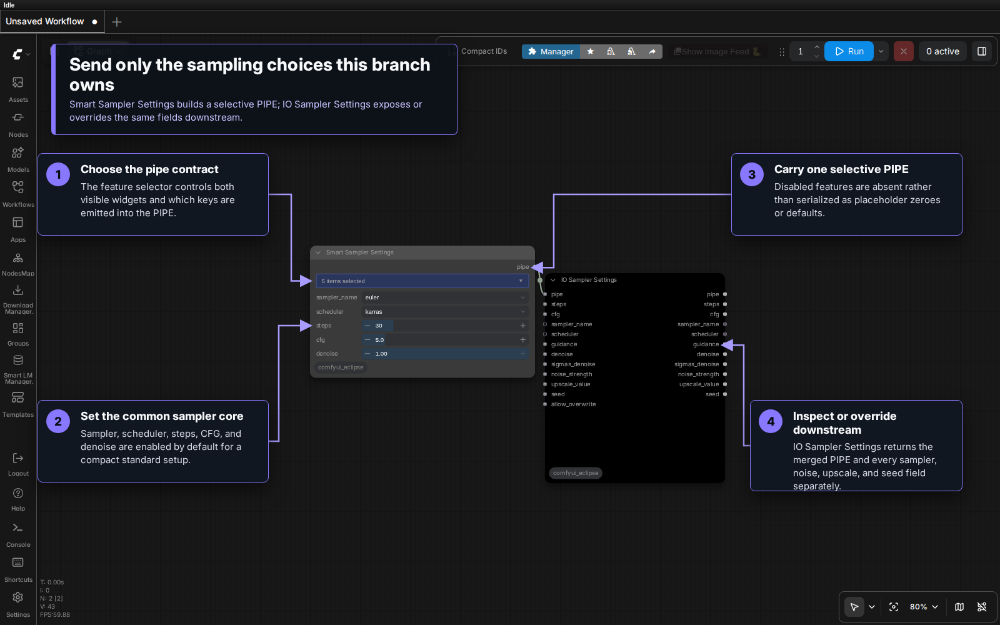
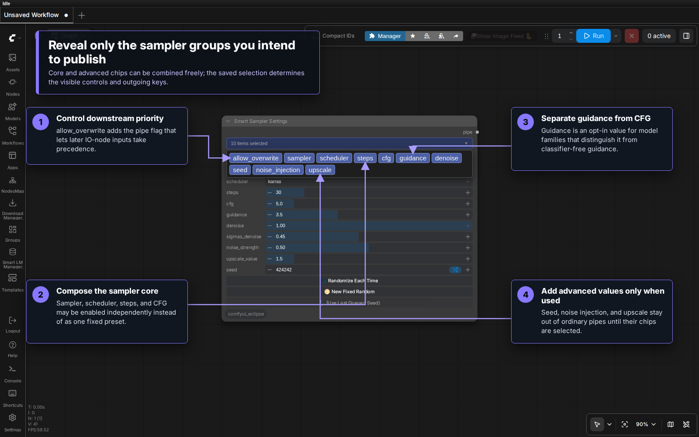
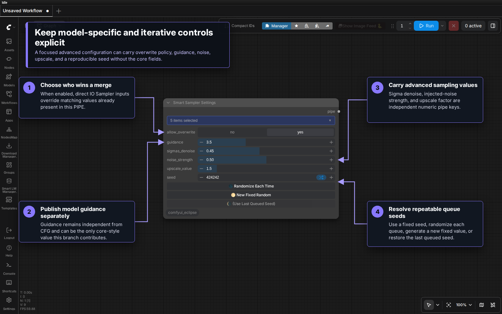

# Smart Sampler Settings [Eclipse]

A combo-chip-driven sampler configuration node with a single seed, selective pipe output, noise injection, and upscale scaling value.

## Table of Contents
- [Smart Sampler Settings \[Eclipse\]](#smart-sampler-settings-eclipse)
  - [Table of Contents](#table-of-contents)
  - [Overview](#overview)
    - [Key Capabilities](#key-capabilities)
  - [Visual Tour](#visual-tour)
  - [Combo-Chip Features](#combo-chip-features)
  - [Inputs](#inputs)
    - [Core Sampler Settings](#core-sampler-settings)
    - [Seed Control (`seed` chip)](#seed-control-seed-chip)
    - [Noise Injection (`noise_injection` chip)](#noise-injection-noise_injection-chip)
    - [Upscale (`upscale` chip)](#upscale-upscale-chip)
    - [Overwrite Flag](#overwrite-flag)
  - [Noise Injection](#noise-injection)
  - [Upscale Parameter](#upscale-parameter)
  - [Allow Overwrite](#allow-overwrite)
  - [Pipe Output](#pipe-output)
    - [Connecting the Pipe](#connecting-the-pipe)
  - [Usage Examples](#usage-examples)
    - [Standard Image Generation](#standard-image-generation)
    - [img2img with Fixed Seed](#img2img-with-fixed-seed)
    - [Upscale Workflow](#upscale-workflow)
  - [Tips \& Best Practices](#tips--best-practices)
  - [Related Documentation](#related-documentation)

---

## Overview

Smart Sampler Settings replaces all legacy Sampler Settings nodes with a single combo-chip interface. Enable only the settings you need — unused parameters are hidden and excluded from the pipe output entirely. This means downstream nodes only receive the values you explicitly configure.

The serialized node ID is **`Smart Sampler Settings [Eclipse]`**.

### Key Capabilities

- **Selective output** — only enabled chips add values to the pipe
- **Single seed system** — simple, unified seed control
- **Noise injection** — sigmas denoise + noise strength for advanced sampling
- **Upscale parameter** — upscale scale factor for upscale workflows
- **Allow overwrite** — optional flag to let IO nodes override these values

---

## Visual Tour

### Selective sampler pipe and IO consumer

The enabled feature set controls both the visible widgets and the keys placed in the outgoing `PIPE`. The default selection provides sampler, scheduler, steps, CFG, and denoise. **IO Sampler Settings** can consume that pipe, merge optional direct inputs according to its overwrite policy, and expose every supported value as a regular output.

### Feature selection

Each chip is independent. Core sampling values can be combined without adopting a fixed preset, while guidance, seed, noise injection, upscale, and overwrite policy remain absent until selected. A disabled chip therefore means “not configured,” not “configured with the widget default.”

### Advanced controls and reproducible seeds

An advanced-only pipe can carry guidance, sigma denoise, injected-noise strength, upscale factor, seed, and overwrite policy without also publishing the standard sampler fields. Seed buttons support per-queue randomization, a new fixed value, and restoration of the last queued seed.

---

## Combo-Chip Features

Each chip controls a parameter group. Only enabled chips include their values in the pipe output.

| Chip | Default | Controls |
|------|---------|----------|
| `allow_overwrite` | off | Allow overwrite flag in pipe |
| `sampler` | **on** | Sampler algorithm selection |
| `scheduler` | **on** | Scheduler algorithm selection |
| `steps` | **on** | Step count slider |
| `cfg` | **on** | CFG scale slider |
| `guidance` | off | Guidance scale slider |
| `denoise` | **on** | Denoise strength slider |
| `seed` | off | Seed input field |
| `noise_injection` | off | Sigmas denoise + noise strength |
| `upscale` | off | Upscale scale factor value |

Default enabled: `sampler`, `scheduler`, `steps`, `cfg`, `denoise`.

---

## Inputs

### Core Sampler Settings

| Input | Type | Default | Range | Chip |
|-------|------|---------|-------|------|
| `sampler_name` | COMBO | *(ComfyUI samplers)* | — | `sampler` |
| `scheduler` | COMBO | *(ComfyUI schedulers)* | — | `scheduler` |
| `steps` | INT | 30 | 1–150 | `steps` |
| `cfg` | FLOAT | 5.0 | 1.0–30.0 | `cfg` |
| `guidance` | FLOAT | 3.5 | 0–10.0 | `guidance` |
| `denoise` | FLOAT | 1.0 | 0–1.0 | `denoise` |
| `seed` | INT | 0 | -3–(2^64-1) | `seed` |

The seed input accepts `-3` through `2^64-1`; the negative values are frontend-resolved queue modes rather than backend seed values.

### Seed Control (`seed` chip)

Enabling `seed` reveals the seed field and three actions:

- **🌑 Randomize Each Time** — stores `-1` and resolves a fresh concrete seed for each queue.
- **🌕 New Fixed Random** — immediately generates and stores a concrete seed.
- **🌘 (Use Last Queued Seed)** — restores the most recently resolved queue seed when one is available.

The field also accepts `-2` for increment and `-3` for decrement. These modes advance from the last resolved seed, falling back to a random seed when no usable previous value exists. The queued prompt and saved workflow metadata receive the resolved concrete value.

### Noise Injection (`noise_injection` chip)

| Input | Type | Default | Range |
|-------|------|---------|-------|
| `sigmas_denoise` | FLOAT | 0.45 | 0–1.0 |
| `noise_strength` | FLOAT | 0.50 | 0–1.0 |

### Upscale (`upscale` chip)

| Input | Type | Default | Range |
|-------|------|---------|-------|
| `upscale_value` | FLOAT | 1.5 | 0.1–10.0 |

### Overwrite Flag

| Input | Type | Default | Chip |
|-------|------|---------|------|
| `allow_overwrite` | BOOLEAN | False | `allow_overwrite` |

---

## Noise Injection

Enable the `noise_injection` chip to expose:

- **`sigmas_denoise`** — controls the sigma denoising schedule strength
- **`noise_strength`** — controls how much noise is injected

Both values are passed through the pipe as `sigmas_denoise` and `noise_strength` keys. Downstream sampler nodes that support noise injection can read these values.

---

## Upscale Parameter

Enable the `upscale` chip to expose:

- **`upscale_value`** — scale factor (e.g., 1.5 = 150% of original size)

This is passed through the pipe for downstream upscale workflows.

---

## Allow Overwrite

Enable the `allow_overwrite` chip to include a `_allow_overwrite` flag in the pipe. When set to `True`, IO pipe nodes can override values from this node with their own direct inputs. When `False` (or absent), this node's values take priority.

---

## Pipe Output

The node outputs a single **PIPE** containing only the values for enabled chips.

| Key | Chip Required | Description |
|-----|---------------|-------------|
| `sampler_name` | `sampler` | Sampler algorithm name |
| `scheduler` | `scheduler` | Scheduler algorithm name |
| `steps` | `steps` | Step count |
| `cfg` | `cfg` | CFG scale |
| `guidance` | `guidance` | Guidance scale |
| `denoise` | `denoise` | Denoise strength |
| `sigmas_denoise` | `noise_injection` | Sigma denoise value |
| `noise_strength` | `noise_injection` | Noise injection strength |
| `upscale_value` | `upscale` | Upscale scale factor |
| `seed` | `seed` | Generation seed value |
| `_allow_overwrite` | `allow_overwrite` | Overwrite permission flag |

**Key behavior:** Disabled chips produce **no pipe keys** for their parameters. This lets downstream nodes distinguish "not configured" from "configured as 0".

### Connecting the Pipe

Use these dedicated nodes to extract, override, or merge sampler settings from the pipe:

| Node | Type | Description |
|------|------|-------------|
| **IO Sampler Settings** | IO (bidirectional) | Extract or override sampler, scheduler, steps, CFG, guidance, denoise, noise injection, upscale, seed, and overwrite policy |
| **IO Context Image** | IO (bidirectional) | Merge sampler settings into a full image context alongside model, clip, vae, latent, images, and prompts |
| **Concat Pipe Multi** | Merge | Combine the sampler pipe with other pipes, such as Smart Model Loader and Smart Folder pipes |

---

## Usage Examples

### Standard Image Generation

1. Enable chips: `sampler`, `scheduler`, `steps`, `cfg`, `denoise`, `seed`
2. Select sampler (e.g., `euler`), scheduler (e.g., `karras`)
3. Set steps=30, cfg=5, denoise=1.0, and configure seed
4. Connect pipe → Smart Model Loader

### img2img with Fixed Seed

1. Enable chips: `sampler`, `scheduler`, `steps`, `cfg`, `denoise`, `seed`
2. Set denoise=0.5 for partial denoising
3. Set a concrete seed
4. Connect pipe → Smart Model Loader

### Upscale Workflow

1. Enable standard chips + `upscale`
2. Set upscale_value=1.5
3. Downstream upscale nodes read upscale parameters from pipe

---

## Tips & Best Practices

- **Enable only what you need** — fewer chips = smaller pipe, cleaner workflow
- **Guidance** is separate from CFG — useful for models that distinguish the two (e.g., Flux)
- **Noise injection** is for advanced workflows — most users only need the core settings
- **Chain with Smart Folder** — folder pipe provides path/dimensions, sampler pipe provides generation settings

---

## Related Documentation

- [Smart Model Loader](https://github.com/r-vage/ComfyUI_SmartModelLoader) - Reads sampler pipe for generation settings
- [Smart Folder](Smart_Folder.md) - Output folder and dimension configuration
- [Save Images](Save_Images.md) - Reads pipe for metadata embedding

---

*Part of [ComfyUI Eclipse](../README.md) - Advanced nodes for ComfyUI*
