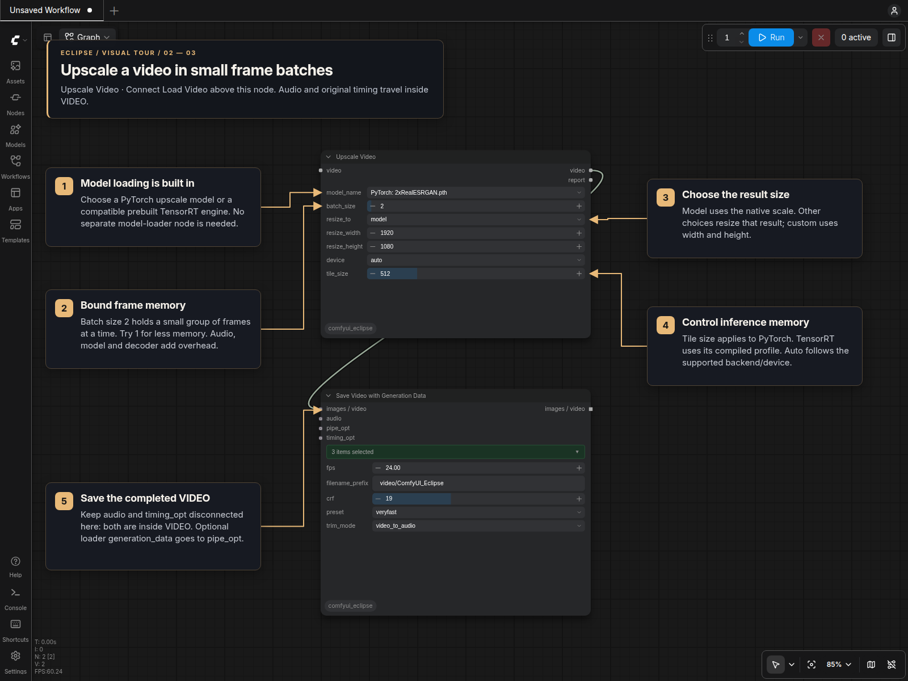

# Upscale Video [Eclipse]

Find **Upscale Video** under **Eclipse → Video**. It loads the selected model,
reads a small batch of video frames, upscales them, writes the result to a
temporary video, and releases the batch before continuing. The output is native
VIDEO with audio and the original frame timing.

## Visual tour

### Direct Eclipse video chain: PyTorch or TensorRT

Connect **Load Video → Upscale Video [Eclipse] → Save Video with Generation
Data** using the VIDEO sockets. Select a `PyTorch:` model or a `TensorRT:`
engine in **model_name**; both backends use these same connections. TensorRT
requires a compatible NVIDIA GPU and engine. No Split Video is needed.


Keep the loader at `timing_mode = source` to retain mixed frame rates. The
upscaler processes bounded frame batches, and audio and timing stay inside VIDEO.
Leave the saver's separate `audio` and `timing_opt` inputs disconnected. The
optional metadata connection is `generation_data → pipe_opt`.

### Upscaler controls

Connect Load Video's `video` to the upscaler's `video` input. The example selects
a regular PyTorch model, a two-frame batch and the model's native output scale.
Its VIDEO output connects directly to Save Video with Generation Data; audio
and timing remain inside VIDEO. The visible custom dimensions apply only when
`resize_to = custom`.



The separate [Split Video route](Load_Video.md#split-video-process-images-while-retaining-their-timing)
is useful for ordinary IMAGE processing, but materializes every frame in RAM.
Keep file-backed VIDEO through this node to use bounded frame batches.

## Connect it

```text
Load Video → Upscale Video → Save Video with Generation Data
```

Connect the loader's optional `generation_data` output directly to the saver's
`pipe_opt`. Audio and timing already travel inside VIDEO; leave the saver's
separate `audio` and `timing_opt` inputs disconnected for this route. No splitter,
external model-loader node, or workflow loop is needed. ComfyUI's built-in Load
Video works as an input too.

Keep Load Video's `timing_mode` at **source** to preserve mixed frame rates. The
upscaler processes every input frame once, retaining frame order, count and
duration. It does not repeat frames, interpolate motion, or apply a new FPS.

## Models and devices

The model dropdown includes a backend label:

| Selection | Location | Requirements |
| --- | --- | --- |
| `PyTorch: …` | ComfyUI's configured `upscale_models` folders | A single-image RGB model supported by ComfyUI/Spandrel. Uses ComfyUI's configured PyTorch device, or CPU. |
| `TensorRT: …` | `models/tensorrt/upscaler`, including subfolders | A prebuilt `.trt`, `.engine`, or `.plan` upscaler and a compatible NVIDIA GPU/TensorRT runtime. |

PyTorch supports non-NVIDIA installations through the device configured in
ComfyUI, such as AMD/ROCm, Apple MPS or Intel XPU where supported by the installed
PyTorch runtime and selected model. Choose **cpu** to run a regular model on CPU.
TensorRT is imported only when a TensorRT model is selected; it is not needed to
load Eclipse or use PyTorch. The separate Auto-TensorRT-Upscaler custom-node pack
is not required.

Existing compatible engines from that pack can be reused. The engine controls
its precision and permitted input dimensions/batches; these are read from the
engine rather than guessed from its filename. Unsupported shapes produce an
explanation. Choose a smaller batch, another engine, smaller loader dimensions,
or a PyTorch model. A short final batch keeps its actual frame count, including
when an engine needs internal padding to its minimum batch size.

This node loads local models. It does not download models, install packages,
convert ONNX files, or rebuild TensorRT engines. Refresh ComfyUI's model lists
after adding files. Use engines you built or obtained from a trusted source.

## Controls

- **batch_size:** maximum number of frames held for one processing batch. Start
  with **2**; use **1** to reduce memory further. TensorRT can infer a batch
  together. PyTorch's tiled runner processes frames within the bounded batch.
- **resize_to:** **model** uses the model's native scale. **2x/3x/4x** resize its
  result to the chosen scale. **1080p/2K/4K** preserve aspect ratio using a
  1920/2560/3840-pixel long edge. **custom** uses both dimension widgets.
- **device:** **auto** follows ComfyUI's device; **cpu** is available for PyTorch.
- **tile_size:** PyTorch's spatial tile size, with overlapping edges. Smaller
  tiles reduce inference memory. The runner reduces it on device OOM down to
  128 pixels. This setting does not change a TensorRT engine's compiled profile.

The `report` output lists backend/device, batch size, dimensions, frame count,
duration, approximate batch storage, and temporary file size.

## Memory, storage and quality

Frame memory grows with batch size and resolution rather than video duration.
The model, decoder, encoder, timestamp list, and aligned audio add overhead.
Audio is held as 48 kHz stereo PCM; it is much smaller than full float image
batches. A component VIDEO created from an existing IMAGE batch still retains
that upstream batch. Use file-backed VIDEO to avoid that allocation.

For example, 9,532 RGB float32 frames at 512×896 need about **48.9 GiB** before
upscaling and **195.5 GiB** at 2×. This node never builds those complete frame
tensors. Available RAM is checked against the selected batch and audio.

Processed frames are quantized once to SDR 8-bit RGB and stored in a lossless
RGB H.264 MOV with uncompressed float PCM audio. There is no chroma subsampling
in this intermediate. It preserves these RGB bytes, not the model's original
floating-point values. Temporary disk usage depends on duration and content;
the node does not retain raw float frame caches. Save Video performs the final
delivery encode. The current Load Video joined output already has an earlier
H.264 encoding step.

The temporary `EclipseUpscale_*.mov` file lives under ComfyUI's configured temp
directory. Failed/cancelled writes are removed. Successful files remain while
cached VIDEO outputs reference them and are removed when the final owner is
released. Preview Video creates a browser-compatible viewing copy. After an
abrupt backend exit, unneeded intermediate files may remain for normal temp
cleanup; stop the backend before manually removing them.

The current path supports SDR RGB file, component, and native concatenated VIDEO
inputs. File trims, crops and display rotation are applied before upscaling.
Convert HDR or composite alpha first. Original source videos and models are
never overwritten.
