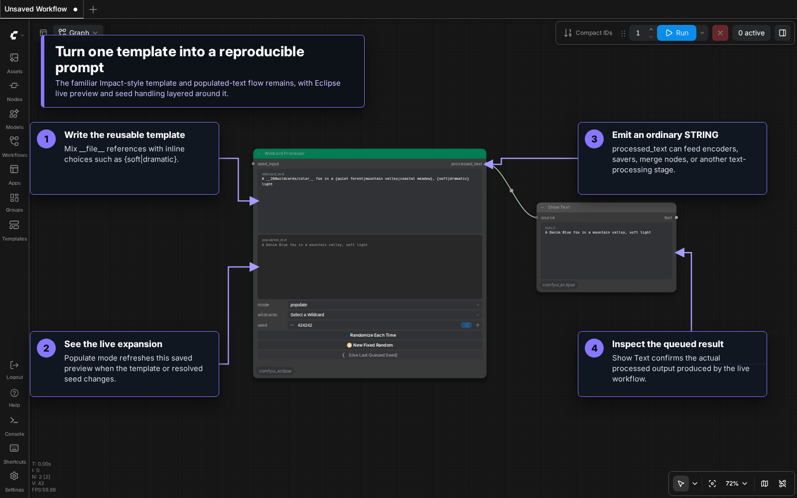
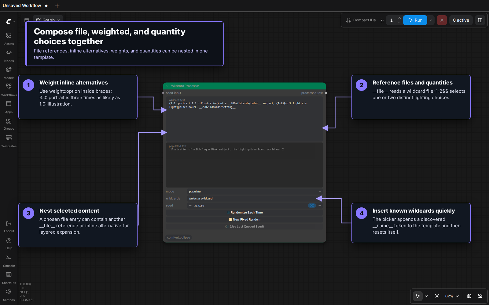
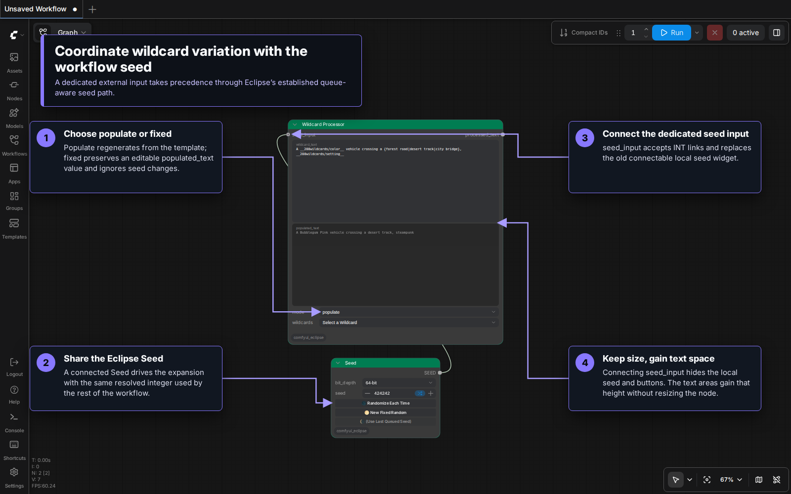

# Wildcard Processor

Wildcard Processor turns a reusable text template into a seeded `STRING`. It combines inline alternatives, wildcard files, weighted choices, nested expansion, quantity selection, live preview, and Eclipse queue-aware seed controls.

> [!NOTE]
> Eclipse's Wildcard Processor evolved from the [ComfyUI Impact Pack Wildcard Processor](https://github.com/ltdrdata/ComfyUI-Impact-Pack) and keeps its familiar template, populated-text, mode, and wildcard-picker layout. Eclipse adds its own live populated preview and queue-aware seed handling.

## Visual tour

### Template, preview, and output



Write the reusable source in `wildcard_text`. In `populate` mode, Eclipse expands it into `populated_text` as the template or local seed changes. The queued result leaves `processed_text` as a normal `STRING`, so it can feed text encoders, save nodes, merge nodes, or another text-processing stage.

### Current wildcard syntax



Inline alternatives, wildcard files, weights, and quantity selectors can be combined and nested, while the `wildcards` picker inserts a discovered `__name__` token without requiring the path to be typed.

### Queue-aware seed controls



The local seed controls support fixed, random-each-time, incrementing, and decrementing values. Connect an Eclipse **Seed** node to `seed_input` to make that external value authoritative at queue time. While connected, Eclipse hides the socketless local seed and its three buttons without changing the node dimensions, so the multiline text fields use the available height. Upstream seed changes are resolved through the same established queue-aware path previously used by connected seed widgets: queue the workflow to resolve the link and refresh `populated_text`.

## Inputs and output

| Socket or widget | Type | Purpose |
|---|---|---|
| `wildcard_text` | STRING | Reusable source template containing wildcard syntax. |
| `populated_text` | STRING | Live expanded preview in `populate` mode with a local seed; editable source in `fixed` mode. Linked seeds refresh it at queue time. |
| `mode` | COMBO | Chooses live expansion or a fixed populated value. |
| `seed` | INT widget | Socketless local seed that makes random choices reproducible and supports Eclipse special values. |
| `seed_input` | INT, optional input | External queue-time seed; overrides `seed` when connected. |
| `wildcards` | COMBO | Inserts a wildcard discovered in the active library. |
| `processed_text` | STRING output | Final text for downstream nodes. |

## Modes

### `populate`

Eclipse processes `wildcard_text` with the effective seed and updates `populated_text`. A fixed non-negative local seed reproduces the same selections when the template and wildcard library have not changed. When `seed_input` is linked, that external value takes precedence and the preview is refreshed during queueing rather than reactively when the upstream node changes.

### `fixed`

The node uses the editable `populated_text` value without expanding `wildcard_text` again. This is useful for pinning or manually correcting a result.

## Syntax reference

All examples below belong in `wildcard_text`.

| Feature | Syntax | Example result |
|---|---|---|
| Inline choice | `{red|green|blue}` | One alternative. |
| Wildcard file | `__colors__` | One line from `colors.txt`. |
| Nested path | `__people/hair-color__` | One line from `people/hair-color.txt`. |
| Weighted choice | `{3.0::portrait|1.0::illustration}` | `portrait` is three times as likely. |
| Fixed quantity | `{2$$red|green|blue}` | Two distinct alternatives, space-separated. |
| Quantity range | `{1-3$$red|green|blue}` | Between one and three distinct alternatives. |
| Custom separator | `{2$$, $$red|green|blue}` | Two alternatives separated by `, `. |
| File quantity | `{2$$__colors__}` | Two distinct entries from the file. |
| File quantifier | `3#__colors__` | Selects three entries and joins them with `|`. |
| Key pattern | `__people/*/hair__` | Selects across wildcard keys matching the pattern. |

Weighted items may also be stored directly in a wildcard file:

```text
3.0::portrait
1.0::illustration
```

The numeric prefix controls probability and is removed from the selected output.

### Nested expansion

A selected line may contain another file reference or inline choice:

```text
# subjects.txt
a {red|blue} __animals__
```

Eclipse continues resolving nested content with a depth limit so accidental cycles cannot expand forever.

### Comments

Lines beginning with `#` and empty lines are ignored in `.txt` wildcard files. In the template itself, a line beginning with `#` is treated as a comment by the wildcard engine.

## Wildcard files

The active library is normally:

```text
ComfyUI/models/wildcards/
```

Eclipse uses its packaged `wildcards/` directory as a fallback and as the source for examples when it creates an absent `models/wildcards` directory. An existing models directory remains user-owned.

### Text files

Use one choice per non-comment line:

```text
# ComfyUI/models/wildcards/colors.txt
amber
blue
crimson
```

Reference it as `__colors__`. Subfolders become slash-separated keys.

### YAML files

`.yaml` and `.yml` files can define nested groups:

```yaml
lighting:
  studio:
    - softbox
    - rim light
  outdoor:
    - golden hour
    - overcast daylight
```

These entries are available as `__lighting/studio__` and `__lighting/outdoor__`.

After adding or changing wildcard files, refresh ComfyUI's node definitions or reload the page so the server library and picker are refreshed.

## Seed behavior

| Seed value or control | Behavior |
|---|---|
| `0` or greater | Reproducible fixed seed. |
| `-1` / **Randomize Each Time** | Resolves a new seed for every queued run. |
| `-2` | Advances from the last resolved seed. |
| `-3` | Steps backward from the last resolved seed. |
| **New Fixed Random** | Creates a new concrete seed and keeps it fixed. |
| **Use Last Queued Seed** | Replaces a special value with the last resolved queue seed. |

When `seed_input` is connected, the external value drives the queued expansion and the hidden local controls yield to that connection. Eclipse resolves the external value once per queue through its established queue-aware seed path, then uses that same value for wildcard expansion, execution, last-seed tracking, and saved workflow metadata. The connection does not provide a reactive live preview: `populated_text` can remain stale until the workflow is queued. Use `Seed [Eclipse]` when another workflow branch must share the same resolved seed.

## Removing unwanted prompt content

Wildcard Processor no longer includes a built-in negative filter. Connect `processed_text` to **Filter Prompt [Eclipse]** downstream when you need to remove unwanted wording, complete phrases, or comma-separated tags. Keeping filtering in the dedicated node makes the wildcard result reusable and exposes the removal rules explicitly in the workflow.

## Practical patterns

### Reproducible prompt variation

```text
{portrait|illustration} of a __subjects__, {soft|dramatic} lighting
```

Keep a fixed seed while editing the template, then use **New Fixed Random** when you want another stable variation.

### Select several entries from one file

```text
color palette: {2$$, $$__colors__}
```

The file is expanded as the choice pool, two distinct entries are selected, and `, ` joins them.

### Freeze and edit

Generate in `populate`, switch to `fixed`, and edit `populated_text`. This preserves the chosen wording even if the seed or source template later changes.

## Troubleshooting

- **A `__name__` token remains in the result:** confirm the file/key exists in the active `models/wildcards` library and refresh the node definitions.
- **Changing the local seed has no effect:** check whether `mode` is `fixed` or `seed_input` is connected.
- **A connected seed changed but the preview did not:** this is expected. Linked values are resolved at queue time, so queue the workflow to refresh `populated_text` and `processed_text`.
- **Results change unexpectedly:** use a concrete non-negative seed; `-1`, `-2`, and `-3` intentionally change between queued runs.
- **You need to remove wording or tags:** add `Filter Prompt [Eclipse]` after Wildcard Processor.
- **A nested template never resolves:** inspect the referenced files for a cycle or a misspelled key.

## Related guides

- [Smart Prompt](Smart_Prompt.md) — build prompts from folder-backed selections.
- [Read Prompt Files](ReadPromptFiles.md) — navigate complete prompt files by index.
- [Prompt Styler](Prompt_Styler.md) — apply structured visual styles.
