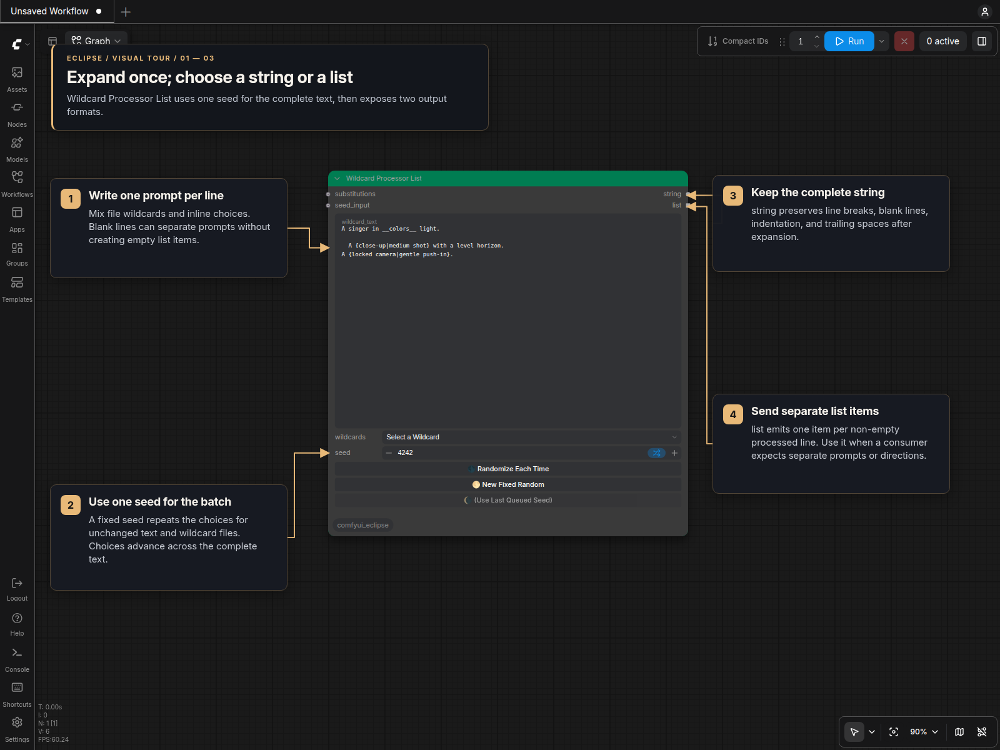
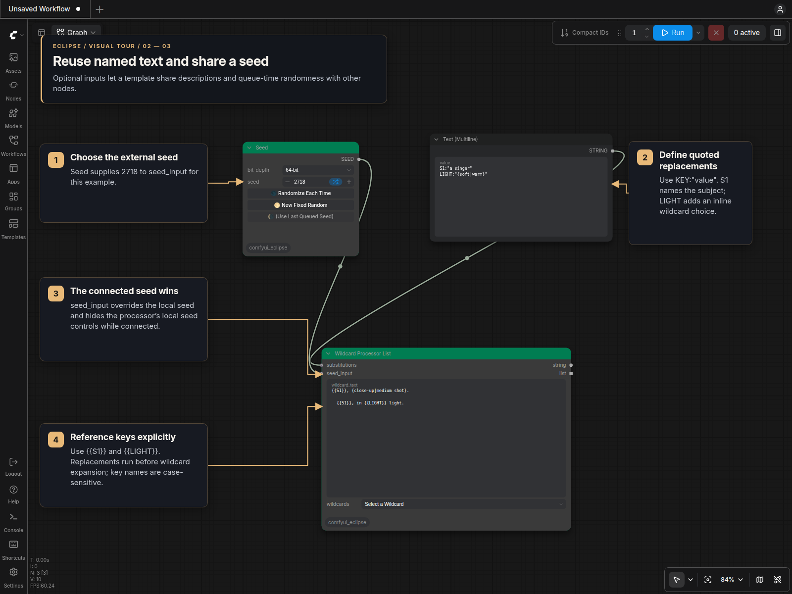
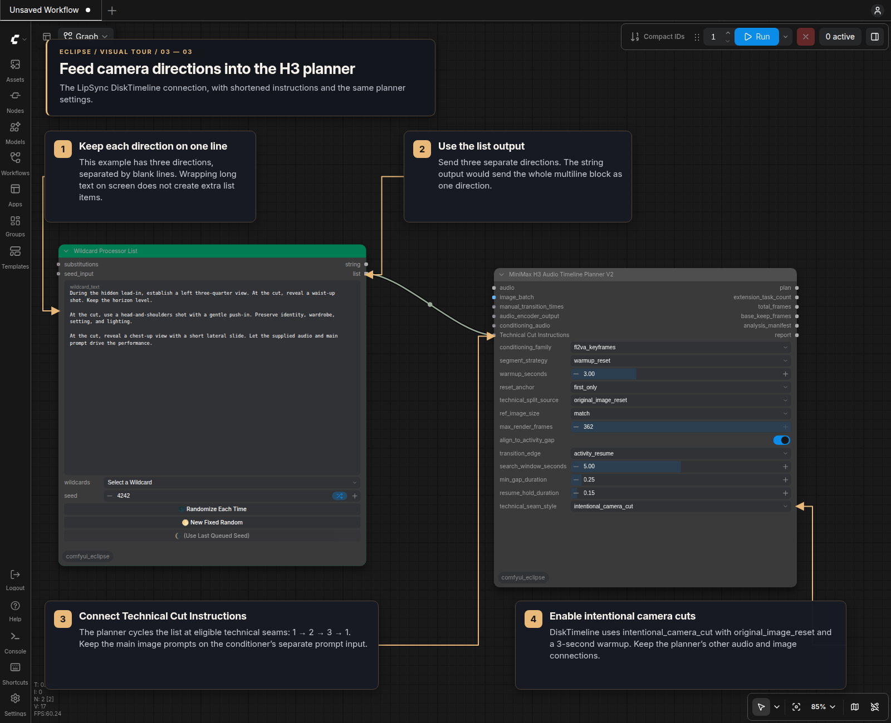

# Wildcard Processor List

`Wildcard Processor List [Eclipse]` expands one prompt or a newline-separated set of prompts with one deterministic wildcard seed. It has no populated-text preview and returns the same processed result in two forms:

- `string` preserves the processed text's line endings, blank lines, indentation, trailing spaces, and other layout.
- `list` contains each non-empty processed line as a separate ComfyUI list item. Whitespace-only lines are omitted, while spacing on retained lines is unchanged.

A source with no newline produces one string and one list item. The complete source is processed as one batch in source order, so a seed drives one continuous sequence of wildcard choices across every line.

## Visual Tour

### One expansion, two output formats



Write one complete prompt or direction per line. File wildcards such as
`__colors__` and inline choices such as `{close-up|medium shot}` expand before
the result is split into list items. Blank lines can separate entries visually.

| Output | What the next node receives | Use it for |
| --- | --- | --- |
| `string` | One complete processed text block, including its blank lines and spacing | A consumer that needs the whole text together |
| `list` | Separate non-empty processed lines, in order | List-aware consumers or per-item processing |

Choose a fixed seed to repeat the choices with unchanged input and wildcard
files. The seed applies to the whole batch; it is not restarted for each line.
There is no populated-text preview inside this node. Connect either output to
ComfyUI's **Preview as Text** to inspect the expanded result.

### Shared descriptions and an external seed



Connect a **Text (Multiline)** node to `substitutions` to reuse named text:

```text
S1:"a singer"
LIGHT:"{soft|warm}"
```

Use `{{S1}}` and `{{LIGHT}}` in the prompt. Substitutions happen first, so the
inline choice inside `LIGHT` expands afterward. Connect **Seed [Eclipse]** to
`seed_input` to share its seed with this processor. The connected seed overrides
the local value and hides the local seed controls until disconnected.

### MiniMax H3 LipSync: technical-cut directions



This focused excerpt follows the DiskTimeline variant of
[MiniMax H3 LipSync](https://civitai.com/models/2935228/minimax-h3-lipsync), saved as
`MiniMaxH3_LipSync_V4_N2_Captions_DiskTimeline.json`: Wildcard Processor List
**#86**, titled **Technical Cut Instructions (one prompt per line)**, sends its
`list` output to **Technical Cut Instructions** on the V2 planner **#81**.
The screenshot shortens the three camera directions for readability and keeps
the saved planner settings. Other planner connections are omitted from the
picture; keep them connected in the full workflow.

1. Put each complete camera direction on one actual line. The saved workflow
   has three non-empty directions separated by blank lines. **Wrap long lines**
   changes only their display; wrapping does not create additional list items.
2. Connect **`list` → Technical Cut Instructions**. Using `string` here passes
   the entire multiline block as one direction, rather than three separate ones.
3. Set `technical_seam_style` to **`intentional_camera_cut`** and
   `technical_split_source` to **`original_image_reset`**. DiskTimeline uses
   `fl2va_keyframes`, `warmup_reset`, and a **3-second warmup**. FL2VA intentional
   cuts require a non-zero warmup so the exact source guide remains hidden.
4. The planner selects directions chronologically at eligible technical seams,
   cycling **1 → 2 → 3 → 1** when needed. These are render-length splits within
   an image interval; changing to the next source image does not consume a cut
   direction.
5. Keep the main image/performance prompts connected to the V2 conditioner's
   prompt input. Also retain its `segment_plan` and `task_index` connections so
   it can append the selected camera direction to the correct task.

The saved directions are ordinary text, so changing the seed alone does not
change them. Add wildcard syntax only where you want variation. List order
controls the cut sequence; the seed controls expansion within its entries.

See the [MiniMax H3 planner guide](MiniMax_H3_Audio_Planner.md#prompt-ownership)
for task prompt ownership and the complete conditioning path.

## Inputs

| Input | Type | Purpose |
| --- | --- | --- |
| `wildcard_text` | STRING, multiline | One prompt or multiple newline-separated prompts using Eclipse wildcard syntax. |
| `substitutions` | STRING, optional connection | Quoted, case-sensitive replacement assignments. |
| `seed` | INT, socketless | Local fixed, random, increment, or decrement seed. |
| `wildcards` | COMBO | Inserts a wildcard token at the last cursor or selection in the text editor, or appends it when no valid position is available. It returns to `Select a Wildcard` after insertion and when repairing legacy null state during copy/paste or reload. |
| `seed_input` | INT, optional connection | External queue-time seed that overrides the local seed. |

The local seed controls match Wildcard Processor: **Randomize Each Time**, **New Fixed Random**, and **Use Last Queued Seed**. Connecting `seed_input` hides those controls until the connection is removed. Resolved seeds are retained when queueing, saving and reloading the workflow, cloning the node, or changing between classic and Nodes 2.0 rendering.

Right-click the node and toggle **Wrap long lines** to switch the multiline editor between wrapped text and horizontal scrolling. The choice is stored per node and survives workflow reloads, cloning, and renderer changes without altering the prompt text.

Opening the wildcard picker can move focus away from the editor. The node remembers the last valid cursor or selection, inserts the chosen wildcard there, and places the cursor after it. Selected text is replaced. If the prompt changed after the position was remembered, the wildcard is appended instead of applying a stale position.

## Substitutions

Assignments use an identifier, a colon, and a quoted value. Separate assignments with commas or newlines outside quoted values:

```text
S1:"a female character", S2:"wearing blue jeans, a white shirt"
```

Reference a value explicitly in `wildcard_text`:

```text
portrait of {{S1}}
{{S2}}
```

Keys are case-sensitive. When a key is assigned more than once, the final assignment wins. Missing references remain unchanged, and replacements are single-pass: a value containing `{{OTHER}}` does not recursively resolve it.

Commas and newlines inside quotes belong to the value. `\"` decodes to a quote and `\\` decodes to one backslash. Other backslash sequences remain literal, so this assignment preserves the escaped parentheses exactly:

```text
S1:"\(any test\)"
```

Substitutions run before wildcard expansion. A value such as `COLOR:"__colors__"` can therefore introduce file wildcard, inline choice, weighted, quantity, or nested wildcard syntax. Malformed assignments are ignored with a concise warning that does not include prompt contents.

## Layout behavior

The node does not clean, join, trim, or normalize the processed text. For example, this source keeps its blank line, indentation, and CRLF or LF line endings in `string`:

```text
first __subject__

  second {close-up|wide shot}  
```

The `list` output contains the two non-empty processed lines, including the two leading and trailing spaces on the second line.

For a live populated preview or an editable fixed result, use [Wildcard Processor](Wildcard_Processor.md). For syntax and wildcard-library locations, see that guide's wildcard syntax and library sections.
